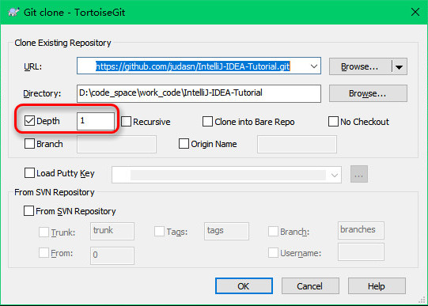

# 重要说明，看三遍

## 特别事件

- IntelliJ IDEA 2018.1 发布（2018-03-28）
	- 新特性列表：<http://www.jetbrains.com/idea/whatsnew>
	- 下载：<http://www.jetbrains.com/idea/download/>

## 介绍(Introduce)

- 本套教程适用于：
	- [IntelliJ IDEA 14、15、2016、2017、2018 版本](https://www.jetbrains.com/idea/)
	- [WebStorm 2016、2017、2018 版本](https://www.jetbrains.com/webstorm)
	- [PhpStorm 2016、2017、2018 版本](https://www.jetbrains.com/phpstorm)
	- [PyCharm 2016、2017、2018 版本](https://www.jetbrains.com/pycharm)
	- [RubyMine 2016、2017、2018 版本](https://www.jetbrains.com/ruby)
	- [Gogland 2017、2018 版本](https://www.jetbrains.com/go)
	- [CLion 2017、2018 版本](https://www.jetbrains.com/clion)
	- [DataGrip 2016、2017、2018 版本](https://www.jetbrains.com/datagrip)
	- [Android Studio 任何版本](https://developer.android.com/studio/index.html?hl=zh-cn)
- 教程主要面向中文用户，如果你英文良好，建议直接阅读官网帮助文档
	- 官网帮助中心：<http://www.jetbrains.com/idea/webhelp/getting-help.html>
- 教程目前在不定时进行调整和补充，需要关注更新的请 `Watch`、`Star`、`Fork`。
- 特别需要友情提醒的是：
    - 请 `Fork` 之后，在我的基础上按你自己喜欢的方式整理一套属于你自己的快捷键列表，并导出为 PDF，以备不时查阅，对于提升开发效率是很有帮助的！
    - 文章的图片建议在需要的时候可以 `右键 - 查看图像（在新标签页打开图片）` 进行原图查看。或者建议你放大页面缩放比例（快捷键 `Ctrl + 鼠标滚轮`），可以更加清楚地看清图片细节。
    - 有的 Gif 动态图片操作过快，你需要暂停 Gif 图片进行观看的话，可以使用这个 Gif 图片查看工具：[7GIF（提取密码：0qo9）](https://pan.baidu.com/s/1mkrESsg)
- 同时邀请您一起参与完善该教程，帮助更多的人，欢迎反馈错误和意见！
- 本系列文章唯一授权的商业网站是：[极客学院](http://www.jikexueyuan.com/)，其他商业网站一律禁止转载。公益站点、个人博客、公众号等载体请在转载写明出处链接。
- 如果你想参与完善该教程，请移步到 Github 上进行 Fork：
    - 地址：<https://github.com/judasn/IntelliJ-IDEA-Tutorial/>
- 如果你需要一份电子版，请查看（制作电子版很费精力，不会常更新此文件）：
    - 百度云：<http://pan.baidu.com/s/1i3wFYPB>
    - Google Drive：[https://drive.google.com/file/d/0B5...UU/view?usp=sharing](https://drive.google.com/file/d/0B5gjjw8peC5Sa19vVEswbTRYYUU/view?usp=sharing "Google Drive")
- GitBook 在线阅读地址：<https://youmeek.gitbooks.io/intellij-idea-tutorial/content/>
- [关于咕泡学院的教程：《IntelliJ IDEA使用教程》侵权说明](http://www.youmeek.com/intellij-idea-tutorial-infringement/)
- [IntelliJ IDEA-Windows-新手必备基础配置整理（密码：z1uo）](http://pan.baidu.com/s/1nvfzKTj)
    - 使用方法：把解压后 config 目录下的所有子目录覆盖到：`C:\Users\你的电脑登录用户名\.IntelliJIdea2017.2\config` 目录下（[Mac 用户](https://github.com/judasn/IntelliJ-IDEA-Tutorial/blob/master/installation-directory-introduce.md#mac-的配置文件保存路径)）
    - 导入后，你过去的一些配置可能会丢失，所以需要重新配置下，每个人都不一样，这需要你自己进行分析。

## 目录(Contents)

- **教程介绍（新用户必看）**
	- [IntelliJ IDEA 介绍](introduce.md)
	- [本教程介绍](about-this-tutorial.md)
- **安装、基础环境介绍（新用户必看）**
	- [Windows 下安装](windows-install.md)
	- [Ubuntu 下安装](ubuntu-install.md)
	- [Mac 下安装](mac-install.md)
	- [安装环境总结](install-summarize.md)
	- [首次运行向导](first-run-wizard.md)
	- [安装后生成的目录说明、VM 设置](installation-directory-introduce.md)
- **首次使用的基础设置介绍（新用户必看）**
	- [UI 界面](interface-introduce.md)
	- [UI 主题、字体、编辑区主题、文件编码修改、乱码问题](theme-settings.md)
- **IntelliJ IDEA 特别地方（新用户必看）**
	- [IntelliJ IDEA 搜索快的原因：索引](IntelliJ-IDEA-cache.md)
	- [IntelliJ IDEA 下 Java 文件编译方式](make-introduce.md)
	- [IntelliJ IDEA 下项目相关特有概念说明](project-composition-introduce.md)
- **必备的快捷键（新用户必看）**
	- [IntelliJ IDEA 常用快捷键讲解（Win + Linux）](keymap-introduce.md)
	- [IntelliJ IDEA 常用快捷键讲解（Mac）](keymap-mac-introduce.md)
	- [从 Windows 过度到 Mac 必备快捷键对照表](keymap-win-mac.md)
	- [最特殊的快捷键 Alt + Enter 介绍](hotkey-alt-enter-introduce.md)
- **提高编码效率功能介绍**
	- [Maven 设置](maven-project-introduce.md)
	- [IntelliJ IDEA 配合 Maven 的一些要点](maven-skill-introduce.md)
	- [版本控制讲解（SVN + Git）](vcs-introduce.md)
	- [实时代码模板](live-templates-introduce.md)
	- [文件代码模板](file-templates-introduce.md)
	- [前端代码模板：Emmet](emmet-introduce.md)
	- [特殊代码模板：Postfix Completion](postfix-completion-introduce.md)
	- [Debug 技巧](debug-introduce.md)
	- [重构技巧](refactor-introduce.md)
	- [数据库管理工具](database-introduce.md)
	- [远程调试介绍（Tomcat + Jetty）](remote-debugging.md)
- **高级设置介绍**
	- [IntelliJ IDEA 常用细节设置-1](settings-introduce-1.md)
	- [IntelliJ IDEA 常用细节设置-2](settings-introduce-2.md)
	- [IntelliJ IDEA 常用细节设置-3](settings-introduce-3.md)
	- [IntelliJ IDEA 常用细节设置-4](settings-introduce-4.md)
- **插件推荐、插件开发**
	- [插件相关功能设置、插件推荐](plugins-settings.md)
	- [Java 热部署插件 JRebel 安装及使用](jrebel-setup.md)
	- [插件开发视频教程](plugins-develop.md)
- **基于 IntelliJ IDEA 下的 demo 尝试**
	- [SpringBoot-Simple-Demo](https://github.com/judasn/SpringBoot-Simple-Demo-From-YouMeek)
	- [SpringBoot-Kafka-Simple-Demo](https://github.com/judasn/SpringBoot-Kafka-From-YouMeek)
	- [Hello World 的 Java 项目创建和项目配置文件](project-settings.md)
	- [基于 Eclipse 的 Java Web 项目在 IntelliJ IDEA 下的环境搭建](eclipse-java-web-project-introduce.md)
	- [Maven 的单模块 / 多模块 Spring MVC + Spring + Mybatis 项目（重点）](maven-java-web-project-introduce.md)
	- [Maven 的单模块 Spring MVC + Spring + Spring Data JPA 项目](maven-java-web-project-introduce2.md)
	- [Maven 的单模块 Spring Boot 项目](maven-java-web-project-introduce3.md)
- **其他（新用户必看）**
	- [常见各类文件类型图标](file-symbols-introduce.md)
	- [本教程总结](this-tutorial-the-end.md)

## 联系(Contact)

- Email：`gitnavi@qq.com`
- Blog（有微信联系方式）：<http://YouMeek.com>
- IntelliJ IDEA QQ 交流群，具体请看：[入群条件说明](https://github.com/judasn/IntelliJ-IDEA-Java-Conversation)
- 欢迎捐赠 ^_^：<http://www.youmeek.com/donate>

## Github 协同视频教程(Participate)

- 如果您不会使用 Git 或是 Github 也没关系，请认真学习下面视频教程：
- YouMeek 录制
    - 视频格式：MP4
    - 分辨率：1920 X 1080
    - 片长：16 Min
    - 文件大小：62 M
- 下载
    - 百度云盘：<http://pan.baidu.com/s/1bogmTLd>

## Github 常用按钮说明

- Watch：关注该项目，作者有更新的时候，会在你的 Github 主页有通知消息。
- Star：收藏该项目，在你的头像上有一个 “Your stars” 链接，可以看到你的收藏列表，以方便下次进来。
- Fork：复制一份项目到自己的 Github 空间上，你可以自己开发自己的这个地址项目，然后 Pull Request 给项目原主人。 
- 只 clone 最新的一个版本记录，历史旧数据不 clone 的两种方法（推荐这样做，因为图片很多，占了很大空间）：
	- 命令行方法：`git clone https://github.com/judasn/IntelliJ-IDEA-Tutorial.git --depth=1`
	- TortoiseGit GUI 方法：

## 参与作者汇总(Author)

- 真心感谢这些志同道合的人，这个真的很重要，也希望你能一起参与（鞠躬）！
- 同时感谢那些通过私聊方式指出一些错误地方的朋友，使得该教程能得以更加完善，真心感谢（鞠躬）！

|作者(按参与时间排序)|地址|
|:---------|:---------|
|YouMeek|<http://YouMeek.com>|
|温泉|<https://github.com/wenquan0hf>|
|zhenhappy|<https://github.com/zhenhappy>|
|two8g|<https://github.com/two8g>|
|Dectinc|<https://github.com/Dectinc>|
|Caliven|<https://github.com/caliven>|
|MinjieTao|<https://github.com/MinjieTao>|
|classloader|<https://github.com/classloader>|
|challengeof|<https://github.com/challengeof>|
|district10|<https://github.com/district10>|
|duanluan|<https://github.com/duanluan>|
|binarywang|<https://github.com/binarywang>|
|chenhui7373|<https://github.com/chenhui7373>|
|wzxjohn|<https://github.com/wzxjohn>|
|Robot-L|<https://github.com/Robot-L>|
|duanluan|<https://github.com/duanluan>|

## AD

- [推荐：程序员的个性化网址导航：GitNavi.com](http://www.gitnavi.com)
