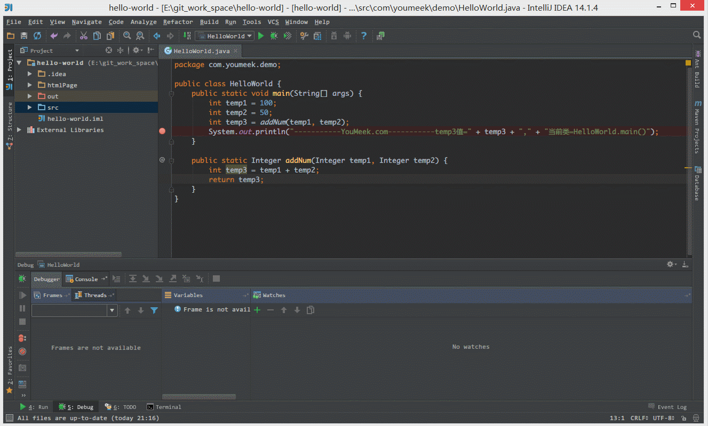
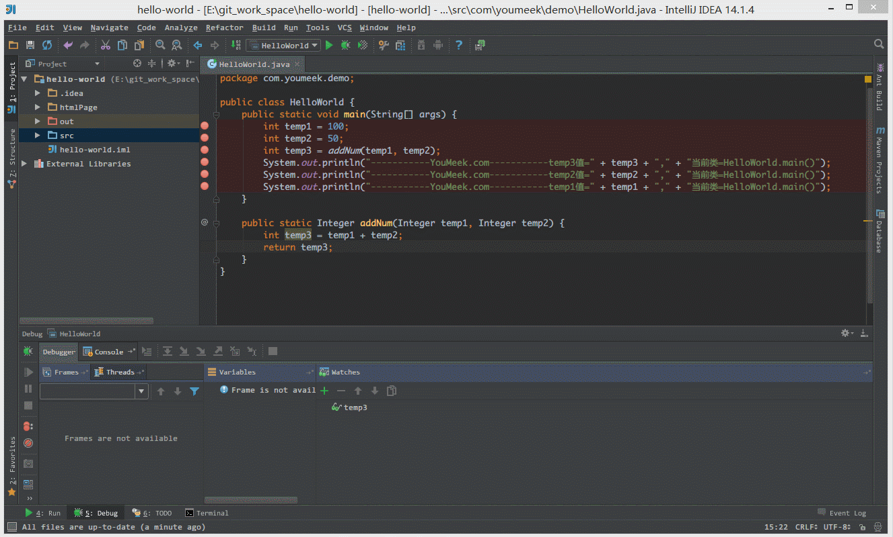
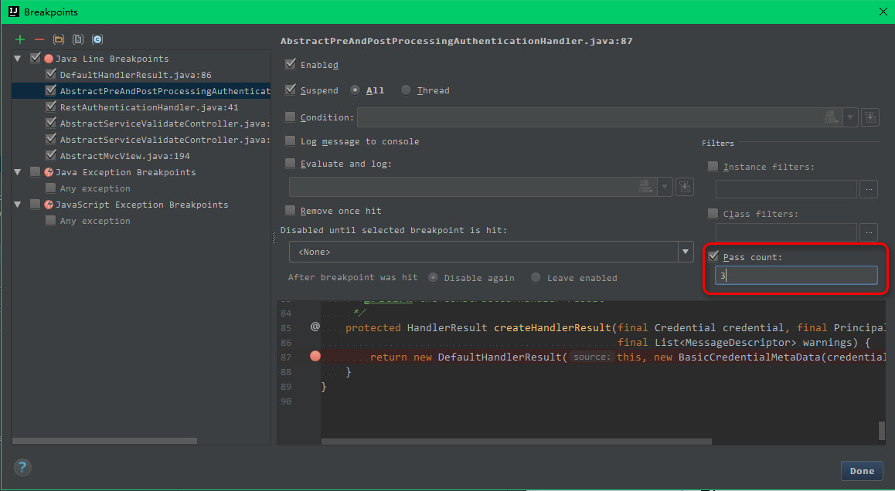
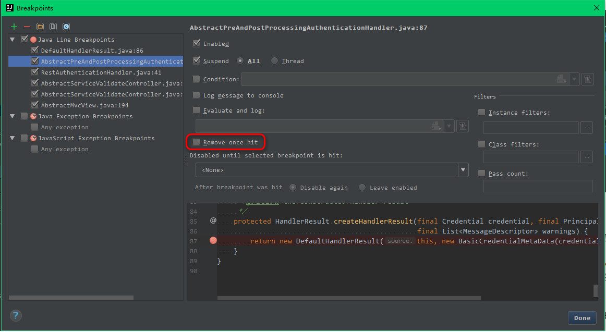
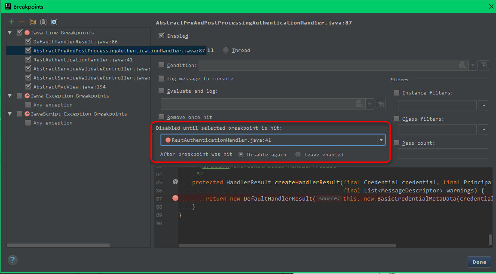
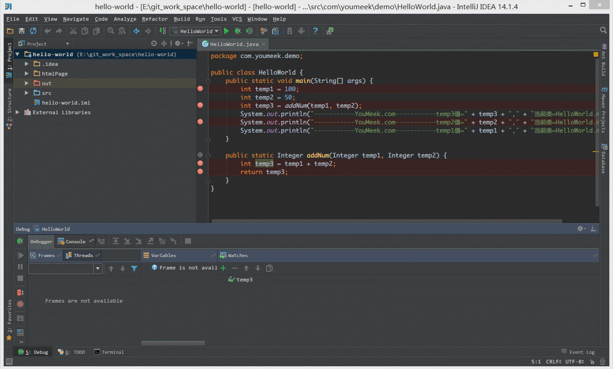
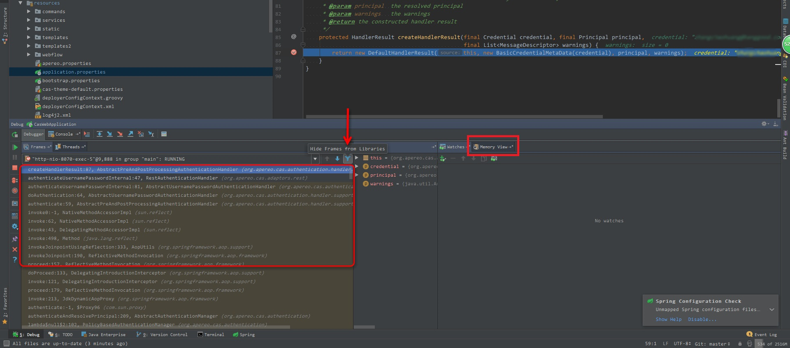

# Debug 介绍

## Debug 设置

> * 如上图标注 1 所示，表示设置 Debug 连接方式，默认是 `Socket`。`Shared memory` 是 Windows 特有的一个属性，一般在 Windows 系统下建议使用此设置，相对于 `Socket` 会快点。

## Debug 常用快捷键

|快捷键|介绍|
|:---------|:---------|
|F7|在 Debug 模式下，进入下一步，如果当前行断点是一个方法，则进入当前方法体内，如果该方法体还有方法，则不会进入该内嵌的方法中 `必备`|
|F8|在 Debug 模式下，进入下一步，如果当前行断点是一个方法，则不进入当前方法体内 `必备`|
|F9|在 Debug 模式下，恢复程序运行，但是如果该断点下面代码还有断点则停在下一个断点上 `必备`|
|Alt + F8|在 Debug 的状态下，选中对象，弹出可输入计算表达式调试框，查看该输入内容的调试结果 `必备`|
|Ctrl + F8|在 Debug 模式下，设置光标当前行为断点，如果当前已经是断点则去掉断点|
|Shift + F7|在 Debug 模式下，智能步入。断点所在行上有多个方法调用，会弹出进入哪个方法|
|Shift + F8|在 Debug 模式下，跳出，表现出来的效果跟 `F9` 一样|
|Ctrl + Shift + F8|在 Debug 模式下，指定断点进入条件|
|Alt + Shift + F7|在 Debug 模式下，进入下一步，如果当前行断点是一个方法，则进入当前方法体内，如果方法体还有方法，则会进入该内嵌的方法中，依此循环进入|
|Drop Frame|这个不是一个快捷键，而是一个 Debug 面板上的按钮。该按钮可以用来退回到当前停住的断点的上一层方法上，可以让过掉的断点重新来过|

有时候我们可以这样粗鲁地认为 Debug 的使用就是等同于这几个快捷键的使用，所以上面的 `必备` 快捷键是我们必须牢记的，这些也是开发很常用的。 

## Debug 特殊技能使用

> * 如上图 Gif 所示，查看所选对象的方法常用有三种方式：
>
>> * 选中对象后，使用快捷键 `Alt + F8`。 
>> * 选中对象后，拖动对象到 `Watches`。 
>> * 选中对象后，鼠标悬停在对象上 2 秒左右。 

> * 如上图 Gif 所示，在弹出表达式输入框中 IntelliJ IDEA 也是能帮我们智能提示。

> * 如上图 Gif 所示，当我们需要过掉后面的所有断点的时候，我们不需要去掉这些断点，只需要点击左下角那个小圆点，点击小圆点之后，所有断点变成灰色，然后我们再在按快捷键 `F9` 即可过掉当前和后面所有的断点。

> * 我们可以给断点设置进入的条件。如上图 Gif 所示，因为变量 temp3 不等于 200 所以该断点没有被进入直接跳过。

> * 如上图，我们可以给断点设置更复杂的步入条件
> * 红框中的 Pass count 表示跳过多少次后开始步入，比如 for 循环中，我们要查看一个变量循环 3 次后的结果就可以使用该方式。

> * 如上图，对于某些不重要的断点，只要步入一次就够了，就可以勾选此选项，让它步入之后自动删除。

> * 如上图，对于某些场景的断点，需要其他断点先触发之后再进行触发，可以选择此项。默认选择的是： None

> * 有时候当我们步入方法体之后，还想回退到方法体外。如 Gif 演示，断点进入 `addNum` 方法后，点击 `Drop Frame` 按钮之后，断点重新回到方法体之外。

> * 上图 IntelliJ IDEA 版本：2017.1.3
> * 如上图左侧红框内容，可以看到当前断点线程执行的堆栈情况，最上面的为当前断点位置，下面的是断点前面执行的方法，如果需要看断点前面走过的路，可以查看该区域。并且可以用图上箭头按钮进行限制显示框架类代码的执行过程，而不是包括依赖 jar 里面的执行过程。
> * 如上图右侧红框内容，可以用来展示单点断点位置的内存情况，对于判断内存溢出相关问题很有帮助。

