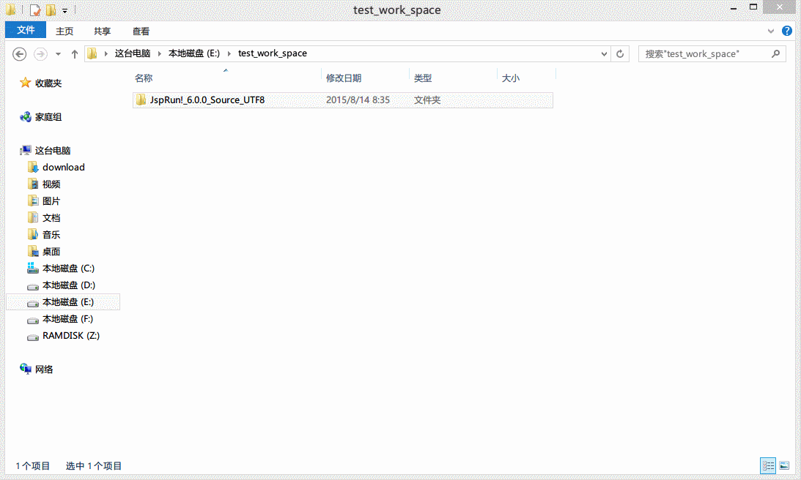
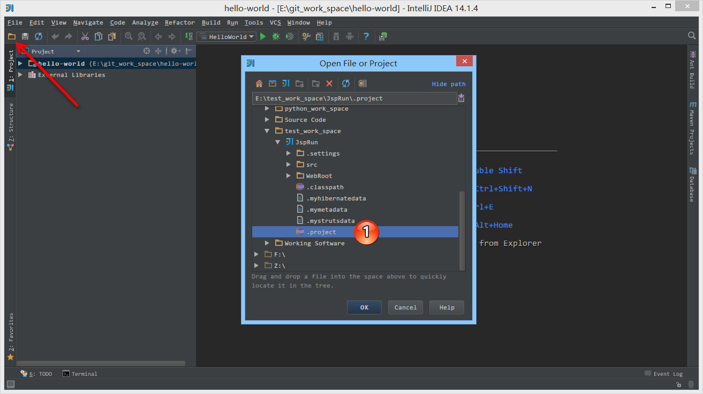
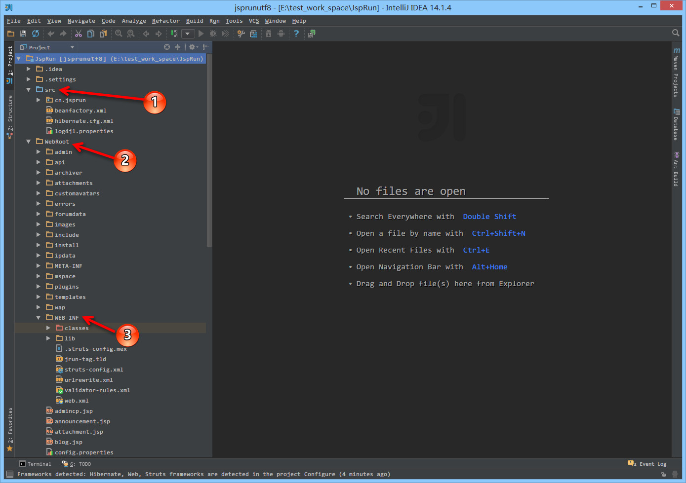
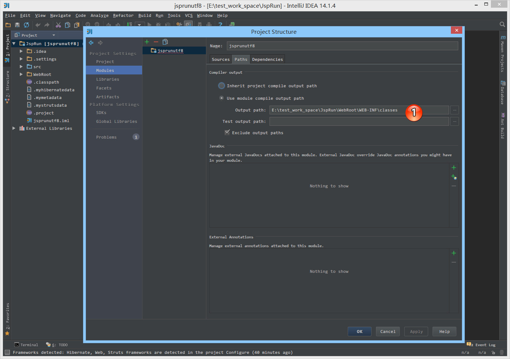
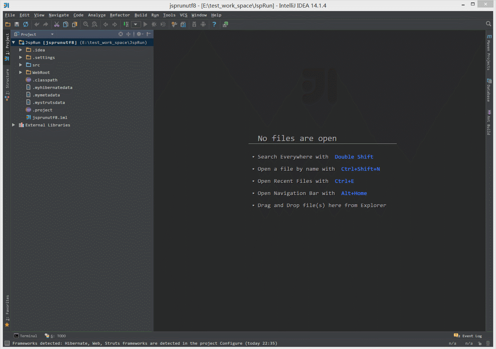
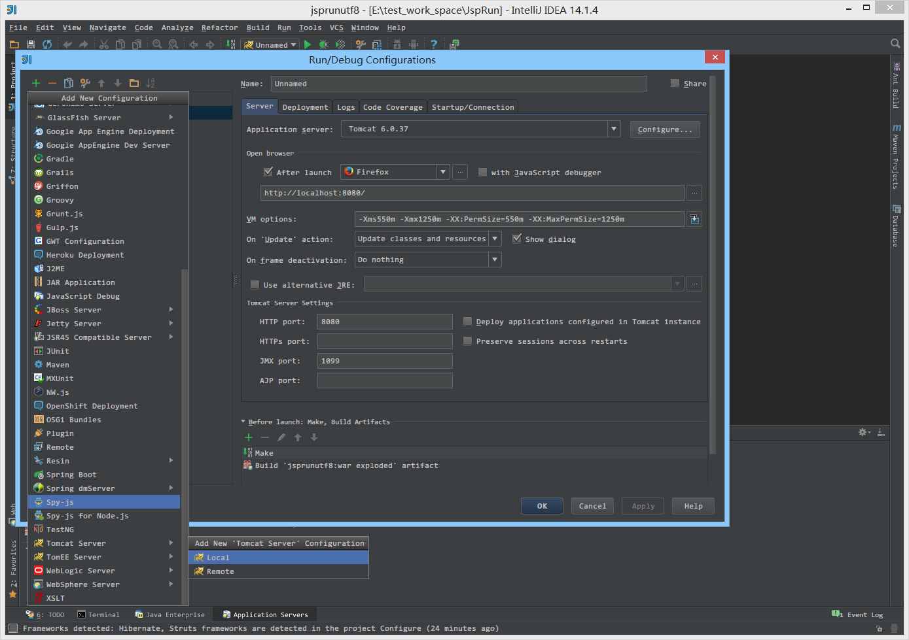
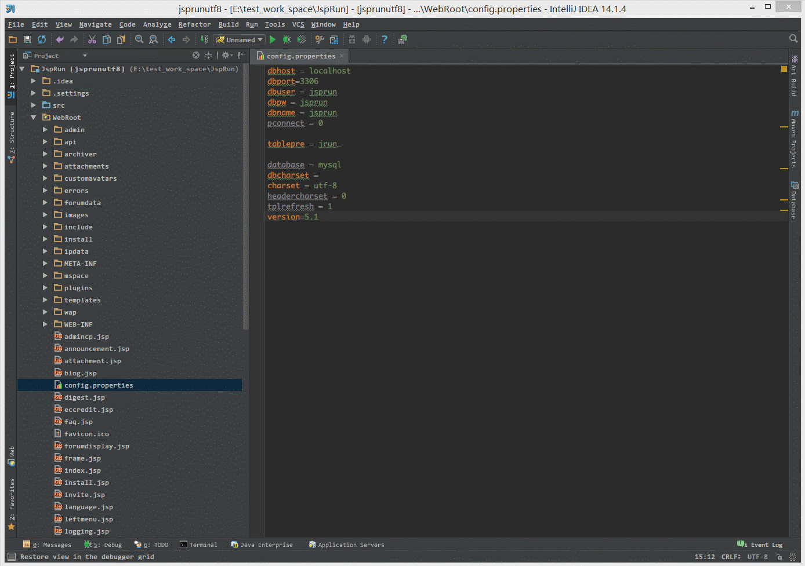
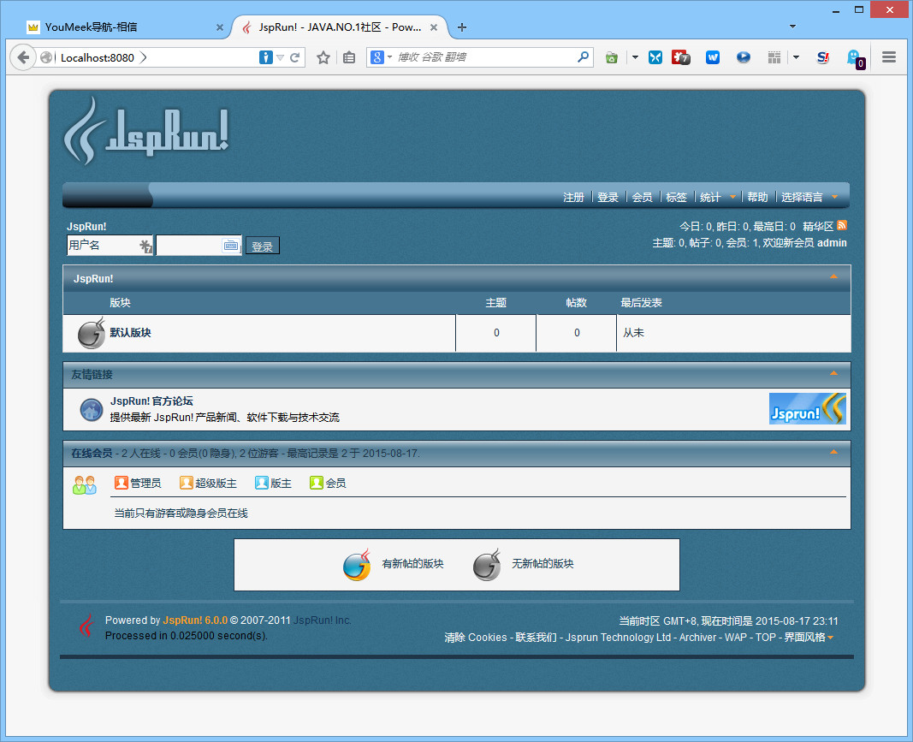
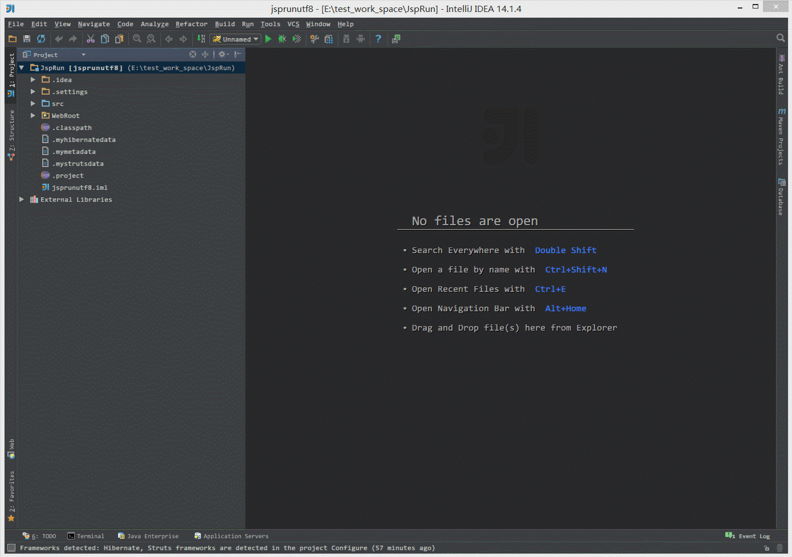

# Eclipse 的 Java Web 项目环境搭建

## Eclipse 项目结构



> * 如上图 Gif 演示，在 Eclipse 下，一般中小项目的项目结构基本都是这种模式的，所以我们这里也通过网上一个开源项目 JspRun 进行讲解。
> * 下载地址：<http://pan.baidu.com/s/1i3zrSf7>

## Eclipse 项目配置



> * 如上图箭头所示，在 IntelliJ IDEA 下是支持直接打开 Eclipse 项目的，无需导入。
> * 如上图标注 1 所示，选择项目的 `.project` 文件打开即可。



> * 如上图标注 1 所示，IntelliJ IDEA 能自动识别到可编译的 `src` 类目录，所以这里文件夹是蓝色的。
> * 如上图标注 2 所示，Java Web 项目 `WebRoot` 是整个项目输出的根目录，所以这个区域也是非常重要的，只是无需配置。
> * 如上图标注 3 所示，`WEB-INF` 下的一些配置文件，以及两个目录 `classes` 和 `lib` 都是至关重要的，其中 `classes` 是红色目录，也就是被排除的，因为编译产生的文件对开发来讲是没有多大意义的，所以进行了排除，但是这并不会影响容器去使用它。


> * 如上图标注 1 所示，因为这个项目是单 Module 的，所以我们这里在 `Project compiler output` 可以选择项目 `WEB-INF` 下的 `classes` 编译目录。


> * 如上图红圈所示，我们可以根据实际情况，对项目的任意目录进行这五种目录类型的标注，选中要标注的目录然后点击想要标注的类型按钮即可，这个知识点非常非常重要，必须会。
>> * `Sources` 一般用于标注类似 `src` 这种可编译目录。有时候我们不单单项目的 `src` 目录要可编译，还有其他一些特别的目录也要作为可编译的目录，就需要对该目录进行此标注。只有 `Sources` 这种可编译目录才可以新建 Java 类和包，这一点需要牢记。
>> * `Tests` 一般用于标注可编译的单元测试目录。在规范的 maven 项目结构中，顶级目录是 `src`，maven 的 `src` 我们是不会设置为 `Sources` 的，而是在其子目录 `main` 目录下的 `java` 目录，我们会设置为 `Sources`。而单元测试的目录是 `src - test - java`，这里的 `java` 目录我们就会设置为 `Tests`，表示该目录是作为可编译的单元测试目录。一般这个和后面几个我们都是在 maven 项目下进行配置的，但是我这里还是会先说说。从这一点我们也可以看出 IntelliJ IDEA 对 maven 项目的支持是比较彻底的。
>> * `Resources` 一般用于标注资源文件目录。在 maven 项目下，资源目录是单独划分出来的，其目录为：`src - main -resources`，这里的 `resources` 目录我们就会设置为 `Resources`，表示该目录是作为资源目录。资源目录下的文件是会被编译到输出目录下的。
>> * `Test Resources` 一般用于标注单元测试的资源文件目录。在 maven 项目下，单元测试的资源目录是单独划分出来的，其目录为：`src - test -resources`，这里的 `resources` 目录我们就会设置为 `Test Resources`，表示该目录是作为单元测试的资源目录。资源目录下的文件是会被编译到输出目录下的。
>> * `Excluded` 一般用于标注排除目录。被排除的目录不会被 IntelliJ IDEA 创建索引，相当于被 IntelliJ IDEA 废弃，该目录下的代码文件是不具备代码检查和智能提示等常规代码功能。
>> * 通过上面的介绍，我们知道对于非 maven 项目我们只要会设置 `src` 即可。

> * 如上图箭头所示，被标注的目录会在右侧有一个总的概括。值得一提的是 `classes` 虽然是 `Excluded` 目录，但是由于它的特殊性且不可编辑，所以不显示在这里。
> * 如上图标注 1 所示，如果要去掉目录的标注含义，可以点击打叉按钮进行删除。



> * 如上图标注 1 所示，这是一个单 Module 的项目，Module 的编译输出目录可以跟 Project 的项目输出目录一致，都是 `WebRoot` 下的 `classes` 目录。


> * 如上图红圈所示，这里显示项目的所有依赖包，其中红色表示 IntelliJ IDEA 无法识别。IntelliJ IDEA 支持一个一个导入依赖包，也支持直接导入一个目录下的所有依赖包。上图的这种就是一个一个具体化的依赖包。除非你的项目各个依赖包有存在依赖顺序关系，不然不建议一个一个引入，这样比较麻烦。所以我这里会先把这些零散的依赖包全部去除掉，然后按目录来引入。
> * 如上图标注 1 所示，依赖包支持这五种操作。
>
>> * 加号，表示可以引入新依赖包。
>> * 减号，表示可以去除对应的依赖包。
>> * 向上箭头，表示依赖包可以向上移动位置。依赖包越上面的表示在项目加载的时候越是优先，所以对于同一个依赖包，不同版本，依赖顺序不同，结果也可能会是大不相同的。
>> * 向下箭头，表示依赖包可以向下移动位置，原因同上。
>> * 笔，表示可以编辑依赖包的名称和路径。


> * 如上图所示，引入依赖包支持 `jar` 包和目录，以及已经导入项目的 `Libraries` 中的依赖包。多 Module 的项目还可以依赖其他 Module。


> * 由于我们刚刚去掉了红圈中的所有依赖包，所以我们现在还需要导入依赖包。在导入之前我们先把项目的 `lib` 作为一个总的依赖包放置到项目 `Libraries` 中。如上图 Gif 演示，就是把 `lib` 目录转换成一个依赖包。这样的好处是，当我们项目需要添加新依赖包时，我们只要放置在 `lib` 目录下即可自动被项目引入，原因就是我们这里引的是目录，而不是一个一个依赖包。


> * 如上图标注 1 所示，引入刚刚放置好的 `Libraries` 下 `lib` 依赖包。



> * 对于传统的 Java Web 项目，我们一般还需要指定配置 web.xml 位置。如上图 Gif 演示，这个一般在 `Facts` 中进行配置。`Facts` 可以理解为用于配置项目的框架区，在这里管理项目使用的框架配置文件。这个是 IntelliJ IDEA 特有的一个配置点。
> * 除了 web.xml 一般我们要配置外，其他一些框架，即使我们不在这里配置也是不会影响项目的运行的，但是是有缺点的，比如我们项目中一般都是有 Spring 框架的，而 Spring 是有很多配置文件的，如果我们在这里进行了配置，那你会发现 IntelliJ IDEA 编辑区底部会多出现几个 Spring 项目的设置区，原因就是你告诉了 IntelliJ IDEA，你的项目使用了 Spring 框架，那 IntelliJ IDEA 就会出现其对应的配置功能给你。Hibernate 等其他框架道理一样。


> * `Artifacts` 也是 IntelliJ IDEA 特有的一个概念，我们可以理解这里是配置项目最终输出结果的地方。比如 Java Web 项目我们一般必备一个配置就是要配置成一个 war 包展开的方式，这样容器才能运行该项目。上图 Gif 演示的就是配置一个 war 包展开的输出结构。其结构是由于前面的几项配置决定，所以如果前面的 Module 配置没有多大问题，这里可以省去一些配置步骤。但是有些时候我们也是需要做一些修改，比如此项目的输出目录默认生成的是错误，我改为了项目中的 `webRoot` 目录。
> * 该 `Artifacts` 配置，等下在配置 Tomcat 的时候也会引用到，所以这里需要重点注意下。

## Tomcat 配置


> * 如上图 Gif 所示，为项目整体的一个 Tomcat 配置过程，有些需要特别讲解的，我们将在下面进行分解。



> * 如上图弹出层所示，IntelliJ IDEA 支持目前市场上主流的应用容器，所以基本上一个 IntelliJ IDEA 足够我们开发常见的项目。但是这里有一点需要提醒的，IntelliJ IDEA 支持这些容器但是不等同于帮我们自带了这些容器的文件，所以上面的 Gif 演示中，原本我只有引入 Tomcat 7，但是为了这个项目我又引入了 Tomcat 6，而引入的 Tomcat 6 我只是指定了其存放的目录位置 IntelliJ IDEA 自动会识别到。


> * 如上图标注 1 所示，我们可以随时为项目切换不同的容器。
> * 如上图标注 2 所示，我们可以指定给运行的容器设置 VM 参数。
> * 如上图标注 3 所示，这分别是在两种命令下的触发的事件。这个是 IntelliJ IDEA 特有的，也是重点。
>
>> * `On Update action` 当我们按 `Ctrl + F10` 进行容器更新的时候，可以根据我们配置的这个事件内容进行容器更新。其中我选择的 `Update classes and resources` 事件是最常用的，表示我们在按 `Ctrl + F10` 进行容器更新的时候，我们触发更新编译的类和资源文件到容器中。在 Debug 模式下，这个也就是所谓的 `HotSwap`。只是这种热部署没有 JRebel 插件那样好用。
>> * `On frame deactivation` 当我们切换 IntelliJ IDEA 到浏览器的时候进行指定事件更新，这个一般是因为 Web 开发的时候，我们需要经常在 IntelliJ IDEA 和各个浏览器之间来回切换测试，所以才有了这种需求。IntelliJ IDEA 是为了帮我们在做这种无聊切换的时候做一些指定事情。当然了，如果切换过于频繁，这个功能还是很耗资源的，所以我设置的是 `Do nothing` 表示切换的时候什么都不做。
> * 如上图标注 4 所示，默认 Tomcat 的 HTTP 端口是 8080，如果你需要改其端口可以在这里设置。
> * 如上图标注 5 所示，这个知识点在前面的文章已经有讲过了。这里表示在 Tomcat 容器运行前做什么事情，这里分别了：Make 和 Build Artifacts 操作。如上面 Gif 演示，这里的 `Build Artifacts` 是我们在 `Deployment` 选项卡中添加了 Artifact 之后自动出现的。

## Tomcat 启动

> * 通过上面的配置，IntelliJ IDEA 环境配置算是配置好了，现在配置下该项目相关的。
> * 打开你的 Mysql，执行下面脚本，创建一个新的数据库和用户：

```sql
CREATE DATABASE `jsprun` CHARACTER SET utf8;
CREATE USER 'jsprun'@'localhost' IDENTIFIED BY 'jsprun';
GRANT ALL PRIVILEGES ON jsprun.* TO 'jsprun'@'localhost';
FLUSH PRIVILEGES;
```

> * 切换到上面新建的 `jsprun` 数据库中执行项目中这个数据脚本，文件位置：`JspRun\WebRoot\install\jsprun_zh_CN.sql`。
> * 修改 `JspRun\WebRoot\config.properties` 文件中的几个属性为下面内容：
> * `dbuser = jsprun`
> * `dbpw = jsprun`



> * 如上图 Gif 演示，我们缺少引入 Tomcat 的依赖包。


> * 如上图 Gif 演示，我们引入 Tomcat 的依赖包之后，可以运行该项目。



> * 如上图所示，为最终项目运行效果图。

## Tomcat 停止


> * 如上图所示，停止按钮是要按两次，第一按完出现一个骷髅头并不是停止，需要再点击一次。
> * 有时候即使点了两次，Tomcat 容器也不一定能完全停掉，这时候很容易出现端口被占用的操作，这时候你需要打开系统的资源管理器，手动 kill 系统上所有的 java 进程。

## 输出 war 压缩包



> * 如上图 Gif 所示，除了在 Artifacts 中需要配置，还需要在容器中也跟着配置，这样在启动容器的时候才会输出一个 war 压缩包。
> * 通过配置，我们也知道 war 的压缩包本质是根据展开的 war 输出包进行压缩的得来。
