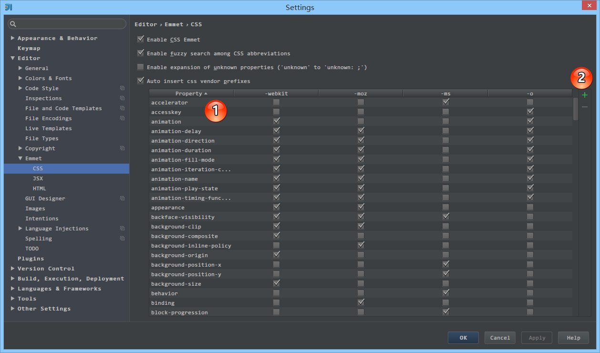

# Emmet 的使用

## Emmet 的介绍

Emmet 的前身叫做：Zen Coding，也许熟知旧名的人不在少数。Emmet 一般前端工程师用得比较多，具体它是做什么的，我们通过下面两张 Gif 演示图来说明：

> * IntelliJ IDEA 自带 Emmet 功能，使用的快捷键是 `Tab`。

Emmet 资料介绍：

> * Emmet 官网：<http://emmet.io>
> * Emmet 官网文档：<http://docs.emmet.io/>
> * Emmet 速查表：<http://docs.emmet.io/cheat-sheet/>
> * Emmet 项目主页：<https://github.com/emmetio/emmet>

## Emmet 的设置

> * 如上图标注 1 所示，IntelliJ IDEA 支持主流四个浏览器内核的一些特别 CSS 书写。
> * 如上图标注 2 所示，可以增加或是删除某些属性。
> * 具体使用，如下图 Gif 演示。

> * 如上图标注红圈所示，在 `Live Templates` 中也有预设三套代码模板。