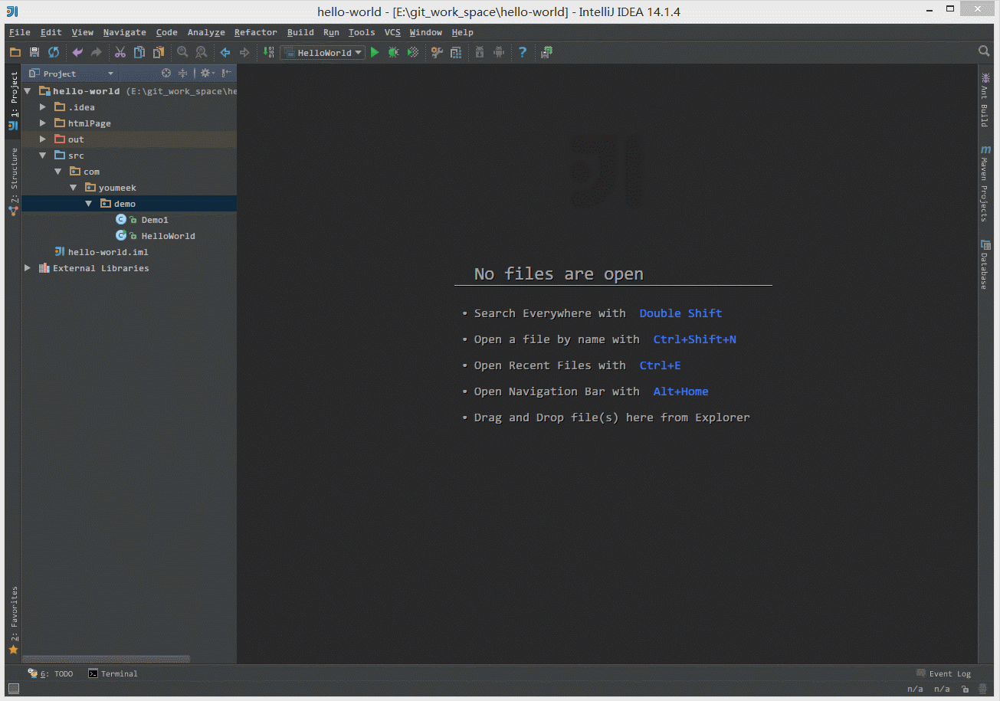
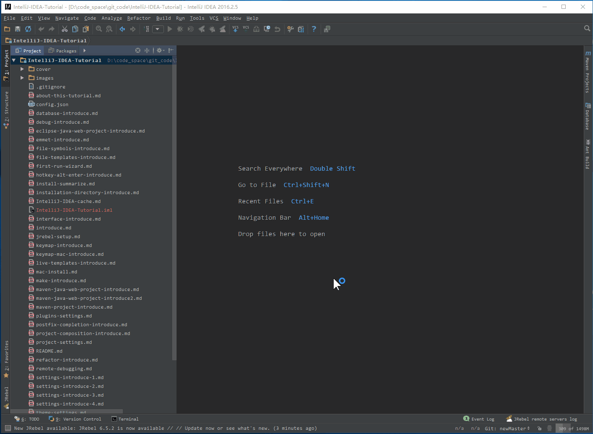
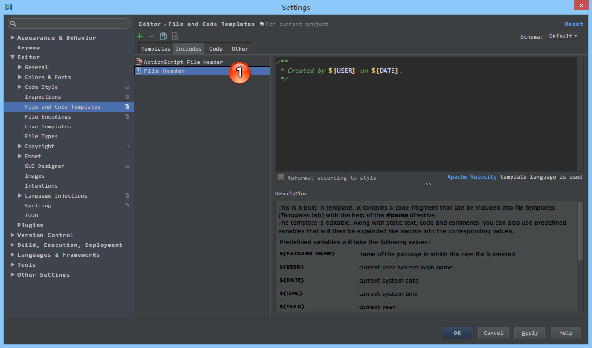
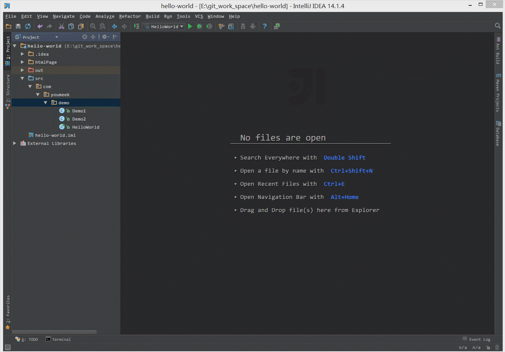
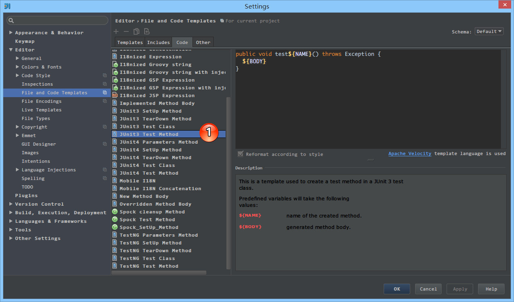

# 文件代码模板的使用

## 文件代码模板的介绍

文件代码模板可以简单理解为：我们在项目中创建某些类型文件时，就已经在对应这些新文件中预设了代码内容。因为文字表达都带有点无力，所以下面用 Gif 动态图来演示。

> * 如上图 Gif 所示，IntelliJ IDEA 默认新建类自带的类注释格式一般不够友好或是规范，所以我们一般需要自己根据公司编码规范进行设置。

> * 如上图 Gif 所示，这是根据我自己的需求进行设置的类注释，这种注释方式会更友好。

根据演示我们应该已经很好地理解了文件代码模板是什么东西了。对此我们可以衍生出很多玩法，比如：我们的项目 Controller、Service、Dao 等常用新对象都是要各自继承某个类、实现某些接口或预设某些方法，也都可以通过这样的文件代码模板来实现。

> * 官网介绍：<https://www.jetbrains.com/idea/help/file-and-code-templates.html>

## 文件代码模板的设置

> * 如上图标注 1 所示，文件代码模板支持的类型基本常见的文件类型都涵盖了。
> * 如上图标注 2 所示，这是 Java 文件模板新建的代码模板，其中 `${PACKAGE_NAME}、${NAME}` 是 IntelliJ IDEA 预设的变量。
> * 如上图标注 3 所示，IntelliJ IDEA 的文件代码模板是可以使用 `Velocity Template Language` (VTL) 进行书写的。如图 2 上的 `#if ... #end` 和 `#parse` 都是 VTL 的语法。
> * 如上图标注 4 所示，介绍当前文件模板的一些信息，以及一些预设变量的作用介绍。
> * 如上图标注 5 所示，这四个按钮是文件代码模板的主要操作按钮，四个操作分别是：
>
>> * `Create Template` 创建一个文件代码模板。 
>> * `Remove Template` 删除一个文件代码模板，标注 1 所示的这些预设模板是不允许删除的，只能能删除预设之外的新增的。
>> * `Copy Template` 复制一个文件代码模板。 
>> * `Reset To Default` 对被修改的预设文件代码模板，还原到默认状态。

> * 如上图 Gif 演示，IntelliJ IDEA 默认是没有提供 XML 文件的创建的，所以我自己创建了一个名为：`YouMeek XML` 的文件模板，该模板后缀为：`xml`，里面的初始化内容为：`<?xml version="1.0" encoding="UTF-8"?>`。初始化的内容你可以根据自己的需求进行补充。

> * 如上图标注 1 所示，IntelliJ IDEA 还支持其他常见会新建的文件类型，基本上我们根本不用担心有不支持的文件类型，常用的基本都被涵盖了。

> * 如上图标注 1 所示，该 `File Header` 文件就是前面 Java 文件代码模板中引入语句中 `#parse("File Header.java")` 文件。

> * 如上图标注箭头所示，`${DESCRIPTION}` 是我们自己定义的变量，自定义变量格式有两种方式：`$变量名 或 ${变量名}`。
> * 自定义的变量在创建对应的文件时候就必须输入内容，这个在本文最上面的 Gif 演示中已经有体现了。

> * 如上图 Gif 所示，当我们需要用到一个固定值的自定义变量的时候并且该变量多个地方被引用，我们可以通过 VTL 语法的 `#set( $变量名 = "变量值内容" );` 来设置。

> * 因为 `Code` 模块改动的人不多，所以放在最后。我们是无法新建、删除 `Code` 里面的代码模板。
> * 如上图标注 1 所示，在我们通过快捷方式生成某个类的测试方法时候会自动调用此 `Code` 模板，所以我们可以解释该 `Code` 功能主要用在 IntelliJ IDEA 自动帮我们生成某些代码的时候引用的模板。

## 文件代码模板预设的变量

因为变量的命名太明了不过了，所以这里不多讲解，直接贴出官网的英文解释：

> * ${PACKAGE_NAME} - the name of the target package where the new class or interface will be created.
> * ${PROJECT_NAME} - the name of the current project.
> * ${FILE_NAME} - the name of the PHP file that will be created.
> * ${NAME} - the name of the new file which you specify in the New File dialog box during the file creation.
> * ${USER} - the login name of the current user.
> * ${DATE} - the current system date.
> * ${TIME} - the current system time.
> * ${YEAR} - the current year.
> * ${MONTH} - the current month.
> * ${DAY} - the current day of the month.
> * ${HOUR} - the current hour.
> * ${MINUTE} - the current minute.
> * ${PRODUCT_NAME} - the name of the IDE in which the file will be created.
> * ${MONTH_NAME_SHORT} - the first 3 letters of the month name. Example: Jan, Feb, etc.
> * ${MONTH_NAME_FULL} - full name of a month. Example: January, February, etc.

PHP 的文件类型预设的变量比上面的还多一点，具体可以查阅官网：

> * 官网变量介绍：<https://www.jetbrains.com/idea/help/file-template-variables.html>
