# 最特殊的快捷键 Alt + Enter 介绍

## 说明

- 这是一个非常特殊的快捷键，有必要拿出来单独讲。
- **强烈注意**：此快捷键跟光标所在位置有着很严重关联关系，光标放的位置不同，使用此快捷键出来的菜单选项完全不一样。
- 可以从几个思路：Java 类、JSP、HTML、JavaScript、CSS、SQL 等文件类型
- 下面演示的各个功能是基于：IntelliJ IDEA 2016.1.1，如果你使用早期版本，可能不一定有对应的功能。

## 智能辅助

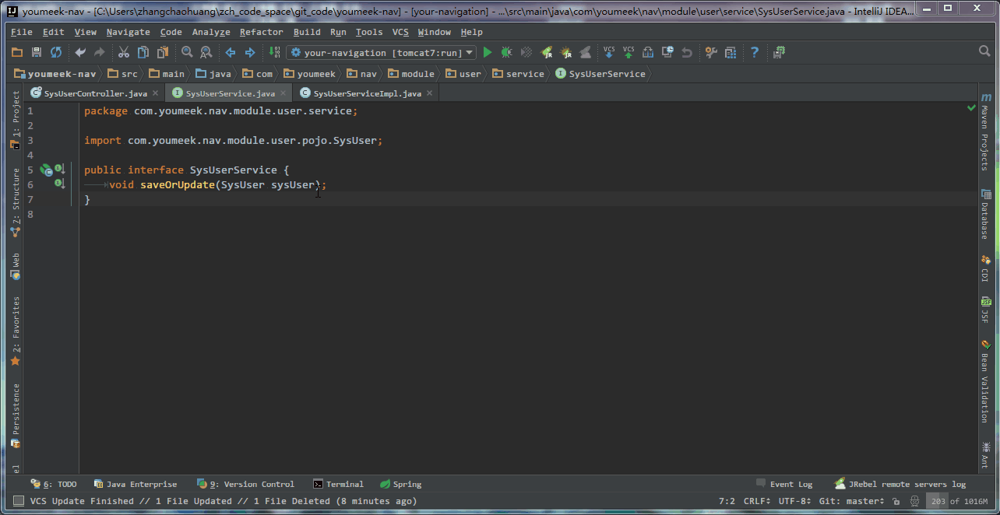

> * 在 **接口类** 中，如果光标当前所在的方法，已经在 **接口实现类** 中生成了，则此快捷键的效果是跳转。
> * 在 **接口类** 中添加一个方法后，让该 **接口实现类** 也跟着生成

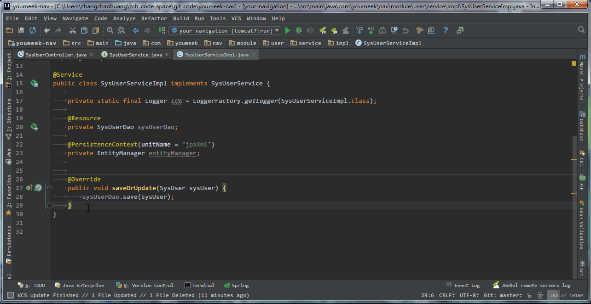

> * 在 **接口实现类** 中添加一个方法后，让该 **接口类** 也跟着生成

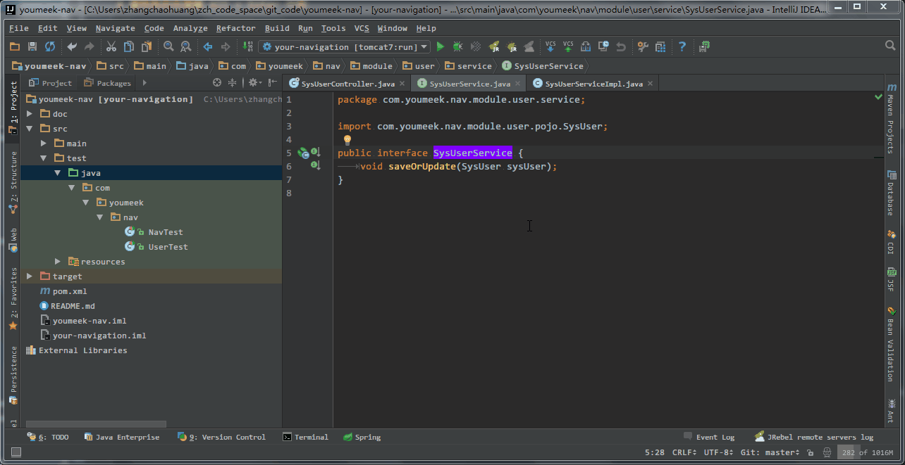

> * 对当前光标所在类，生成单元测试类

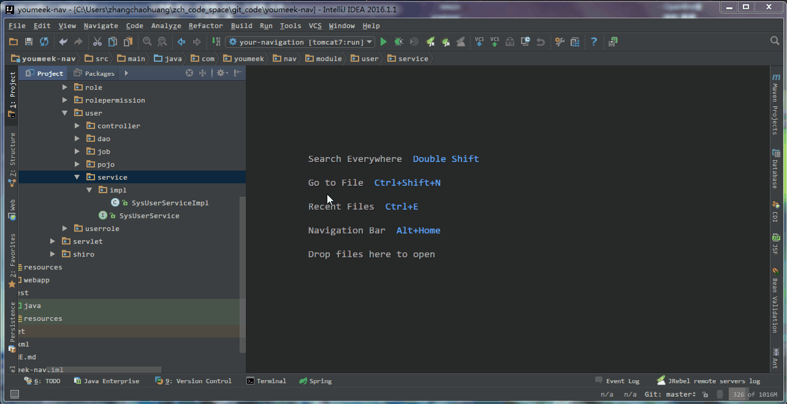

> * 对当前光标所在类，创建子类，常用在对接口生成接口实现类

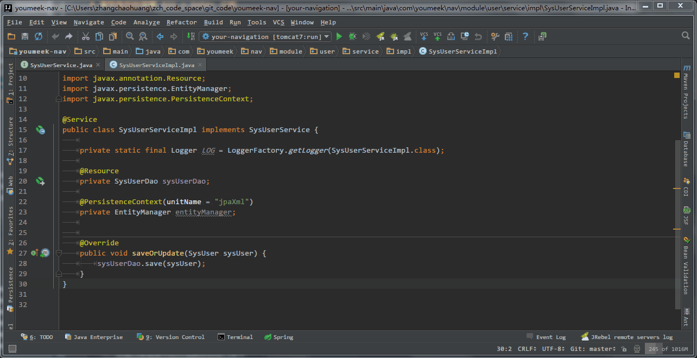

> * 移除未使用的变量、对象等元素

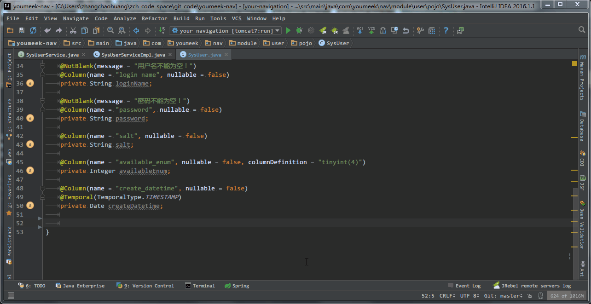

> * 对属性创建 set、get 方法

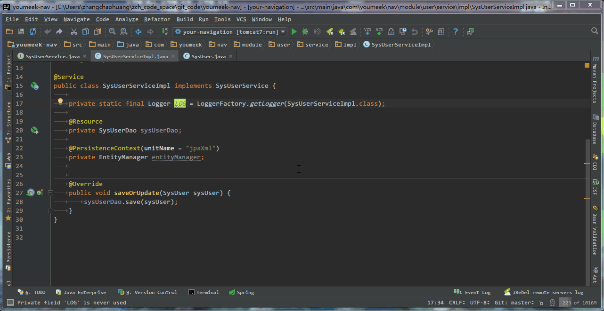

> * 添加 doc，只能把光标放在方法名或是变量名等这类元素上才会有

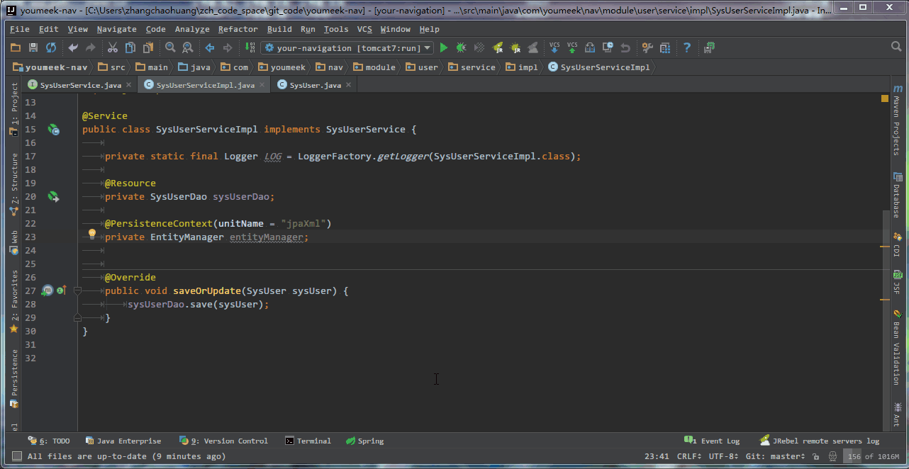

> * 把自己造的单词加入词库中，让拼写单词检查错误的波浪线效果消失。

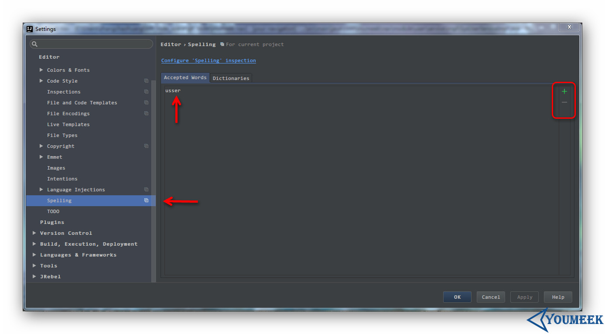

> * 自己造的词库在上图所示位置。

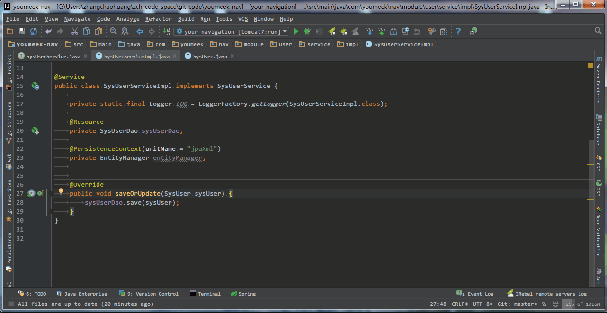

> * 快速移除当前类所继承的接口，并且同时清空已经写好的该接口所有的 Override 方法。
> * 光标只能方式 **接口实现类** 上的 **接口对象单词** 上才可以实现。

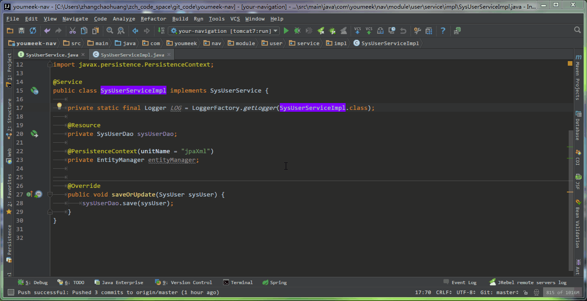

> * 修改光标当前元素的作用域

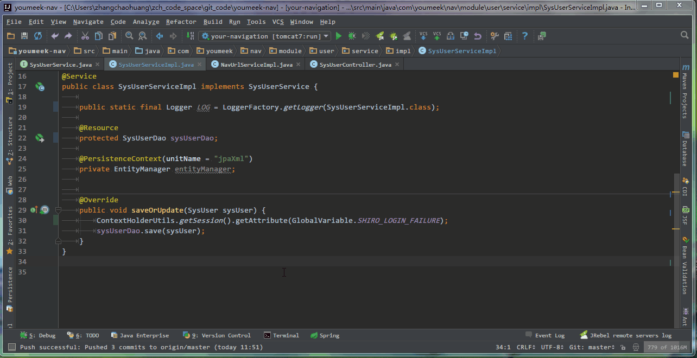

> * 给调用的方法生成返回值
> * 根据返回值自动强转

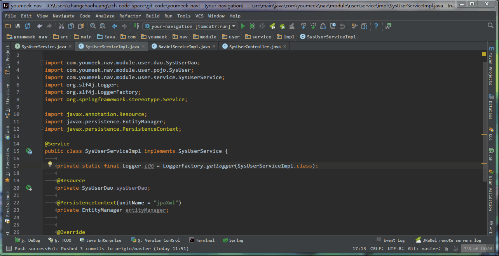

> * 对光标所在的对象进行包导入

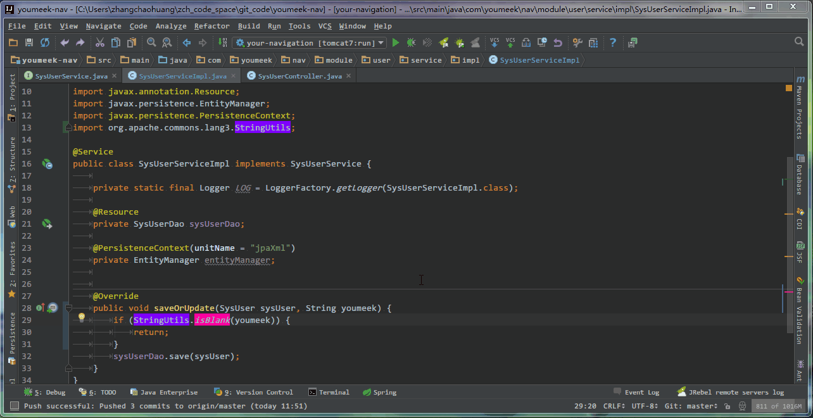

> * 切换成静态导入

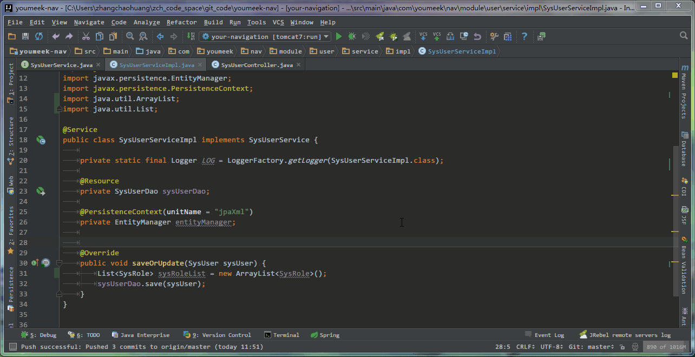

> * 根据 Language Level 级别不同，JDK 特性不同，给不同意见。Language Level 的含义在其他章节有讲过。

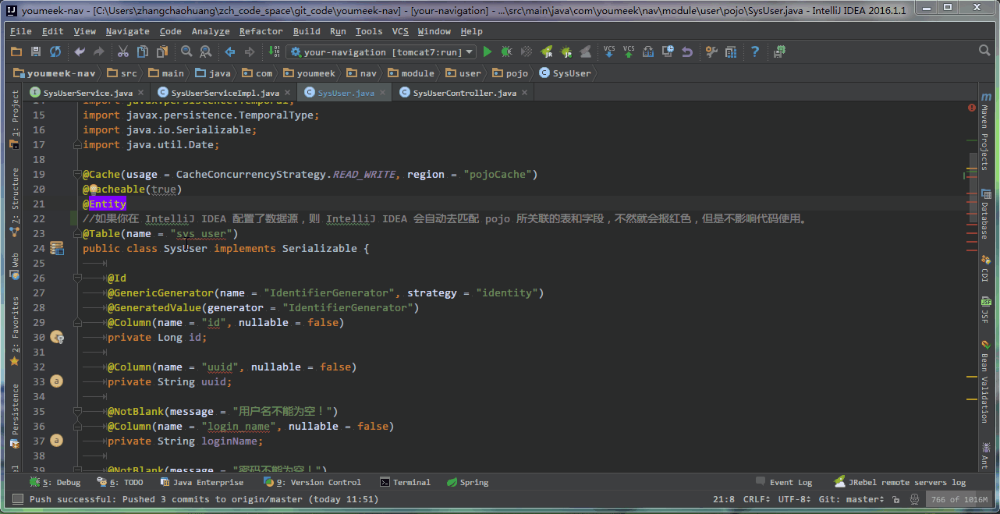

> * 给 Hibernate 的 Entity 对象分配数据源，从而产生一系列智能功能

