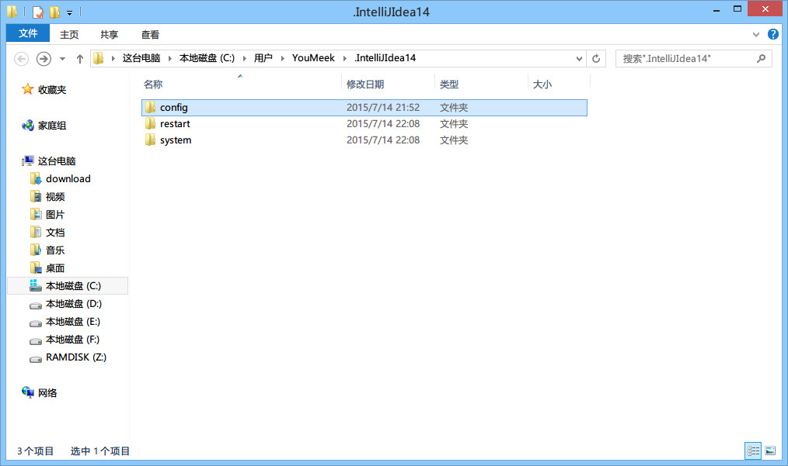
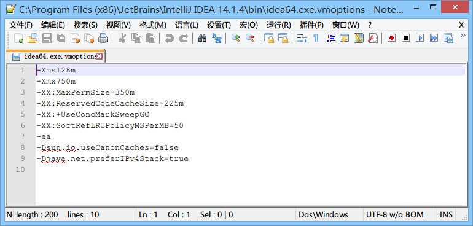
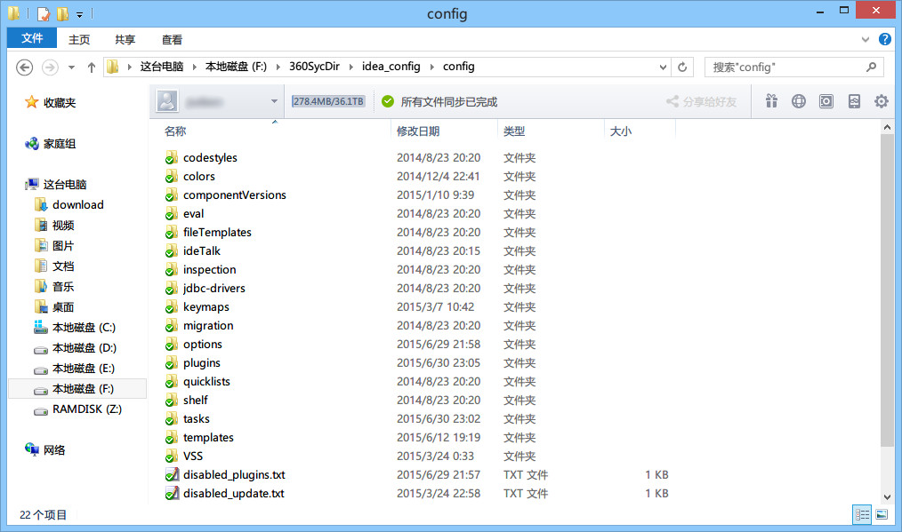

# IntelliJ IDEA 相关核心文件和目录介绍

## 安装目录介绍

> * IntelliJ IDEA 的安装目录并不复杂，上图为最常改动的 bin 目录，经常会改动的文件或是必须介绍就是如图红色框中的几个。
> * `idea.exe` 文件是 IntelliJ IDEA 32 位的可行执行文件，IntelliJ IDEA 安装完默认发送到桌面的也就是这个执行文件的快捷方式。
> * `idea.exe.vmoptions` 文件是 IntelliJ IDEA 32 位的可执行文件的 VM 配置文件，具体配置修改会下面进行专门讲解。
> * `idea64.exe` 文件是 IntelliJ IDEA 64 位的可行执行文件，要求必须电脑上装有 JDK 64 位版本。64 位的系统也是建议使用该文件。
> * `idea64.exe.vmoptions` 文件是 IntelliJ IDEA 64 位的可执行文件的 VM 配置文件，具体配置修改会下面进行专门讲解。
> * `idea.properties` 文件是 IntelliJ IDEA 的一些属性配置文件，具体配置修改会下面进行专门讲解。

- **强烈推荐不要直接修改安装目录下的这几个配置文件，因为 IDEA 升级/重装可能会导致修改完全失效！**
- **强烈推荐使用 IDEA 自带菜单中的 `Help -> Edit Custom VM Options` 和 `Help -> Edit Custom Properties` 来进行参数个性化配置！**

## 设置目录介绍

> * 不管你使用的是哪个操作系统，IntelliJ IDEA 的设置目录命名是统一的、有规律：.IntelliJIdea14。其中 14 表示大版本号，如果你电脑上还同时装有 13 的版本，那则还应该会有一个：`.IntelliJIdea13` 的设置目录，其他版本道理一样。 
> * 在三大主流的操作系统上该文件夹都在当前用户的 Home 目录，Windows 上即 `%userprofile%`，Linux 和 Mac 上即 `~`
> * 对于这个设置目录有一个特性，就是你删除掉整个目录之后，重新启动 IntelliJ IDEA 会再自动帮你再生成一个全新的默认配置，所以很多时候如果你把 IntelliJ IDEA 配置改坏了，没关系，删掉该目录，一切都会还原到默认，我是很建议新人可以多自己摸索 IntelliJ IDEA 的配置，多几次还原，有助于加深对 IntelliJ IDEA 的了解。
> * `config` 目录是 IntelliJ IDEA 个性化化配置目录，或者说是整个 IDE 设置目录。也是我个人认为最重要的目录，没有之一，如果你还记得安装篇的介绍的时候，安装新版本的 IntelliJ IDEA 会自动扫描硬盘上的旧配置目录，指的就是该目录。这个目录主要记录了：IDE 主要配置功能、自定义的代码模板、自定义的文件模板、自定义的快捷键、Project 的 tasks 记录等等个性化的设置。
> * `system` 目录是 IntelliJ IDEA 系统文件目录，是 IntelliJ IDEA 与开发项目一个桥梁目录，里面主要有：缓存、索引、容器文件输出等等，虽然不是最重要目录，但是也是最不可或缺目录之一。

## 配置文件常见修改内容说明

> * 上图是 64 位可执行文件的 JVM 配置文件内容，如果你是 32 位的系统你应该修改的是 `idea.exe.vmoptions` 文件里面的内容，但是由于 32 位系统内存一般都是 2G 左右的，所以也没有多大空间可以调整，所以一般无需调整的。
> * 修改的原则主要是根据自己机器的内存情况来判断的，我个人是建议 8G 以下的机子或是静态页面开发者都是无需修改的。如果你是开发大型项目、Java 项目或是 Android 项目，并且内存大于 8G，建议进行修改，常修改的就是下面 4 个参数，我这里主要以我的机子为例进行建议，每个人机子情况不一，这里也只是做一个引子，最好的调整方式是你可以根据 jconsole 这类工具进行观察后个性化调整。
> * **强烈推荐**使用 IDEA 自带菜单中的 `Help -> Edit Custom VM Options` 来进行个性化配置，而不是直接修改安装目录中的该文件！
> 
>> * `-Xms128m`，16 G 内存的机器可尝试设置为 `-Xms512m`
>> * `-Xmx750m`，16 G 内存的机器可尝试设置为 `-Xmx1500m`
>> * `-XX:MaxPermSize=350m`，16G 内存的机器可尝试设置为 `-XX:MaxPermSize=500m`（P.S：2017 后的版本该参数被剔除）
>> * `-XX:ReservedCodeCacheSize=225m`，16G 内存的机器可尝试设置为 `-XX:ReservedCodeCacheSize=500m`

> * 上图是 IntelliJ IDEA 一些属性配置，没有 32 位和 64 位之分，修改原则主要根据个人对 IntelliJ IDEA 的个性化配置情况来分析。
> * **强烈推荐**在阅读了安装目录中的带注释的配置文件后，使用 IDEA 自带菜单中的 `Help -> Edit Custom Properties` 来进行个性化配置！
> * 常修改的就是下面 4 个参数：
>
>> * `idea.config.path=${user.home}/.IntelliJIdea/config`，该属性主要用于指向 IntelliJ IDEA 的个性化配置目录，默认是被注释，打开注释之后才算启用该属性，这里需要特别注意的是斜杠方向，这里用的是正斜杠。
>> * `idea.system.path=${user.home}/.IntelliJIdea/system`，该属性主要用于指向 IntelliJ IDEA 的系统文件目录，默认是被注释，打开注释之后才算启用该属性，这里需要特别注意的是斜杠方向，这里用的是正斜杠。如果你的项目很多，则该目录会很大，如果你的 C 盘空间不够的时候，还是建议把该目录转移到其他盘符下。
>> * `idea.max.intellisense.filesize=2500`，该属性主要用于提高在编辑大文件时候的代码帮助。IntelliJ IDEA 在编辑大文件的时候还是很容易卡顿的。
>> * `idea.cycle.buffer.size=1024`，该属性主要用于控制控制台输出缓存。有遇到一些项目开启很多输出，控制台很快就被刷满了没办法再自动输出后面内容，这种项目建议增大该值或是直接禁用掉，禁用语句 `idea.cycle.buffer.size=disabled`。

## 设置目录进行多台设置同步化处理

> * 上图是我的个性化配置目录，我是存放在 F 盘，同时该目录也是在 360 同步盘中。这样做主要是为了让我的多台设置可以同时使用一个个性化配置，保证个人开发习惯，额外作用就是在服务器上一个备份作用。
> * 设置方式很简单，修改 `idea.properties` 属性文件中的 `idea.config.path` 值，我的机器为：`idea.config.path=F:/360SycDir/idea_config/config`

# Mac 的配置文件保存路径

- 下面内容中：`XXXXXX`，表示 IntelliJ IDEA 的版本号，IntelliJ IDEA 的配置目录是跟版本号有关系的。
- `/Users/你的用户名/Library/Application Support/IntelliJIdeaXXXXXX`，用于保存安装的插件
- `/Users/你的用户名/Library/Caches/IntelliJIdeaXXXXXX`，用于保存缓存、日志、以及本地的版本控制信息（local history 这个功能）
- `/Users/你的用户名/Library/Preferences/IntelliJIdeaXXXXXX`，用于保存你的个人配置，等价于 Windows 下的 `config` 目录

# Linux 的配置文件保存路径

- 跟 Windows 的目录命名习惯一样，所以你可以直接按 Windows 的配置目录名称来全盘搜索。

# Mac 下修改 VM 参数

## 方法一（官方推荐）

大部分情况下，修改 VM 参数可以使用 IDEA 自带的选项：
`Help -> Edit Custom VM Options`
这个选项会自动帮你在正确的位置用正确的名字新建一个 VM 参数配置文件，并在当前 IDEA 窗口自动打开。我们只需要按需编辑，保存后重启即可。
建议在编辑的时候查看一下文件的原始路径，以备改错参数导致无法启动时恢复使用。
这种方法修改不会由于升级 IDEA 导致修改被还原。

## 方法二

手动修改个人配置下的 `idea.vmoptions` 文件，完整的路径为：
`/Users/你的用户名/Library/Preferences/IntelliJIdeaXXXXXX/idea.vmoptions`
或者可以简写为：
`~/Library/Preferences/IntelliJIdeaXXXXXX/idea.vmoptions`
如果该文件不存在，按照名称新建一个即可。
推荐直接使用命令行进行编辑。
Finder 中进入该文件夹的方法是：
- 打开 Finder
- 按快捷键 Command + Shift + G
- 在弹出窗口中输入 `~/Library/Preferences/`
- 找到对应版本的 `IntelliJIdea` 文件夹
- 新建或修改 `idea.vmoptions` 文件

