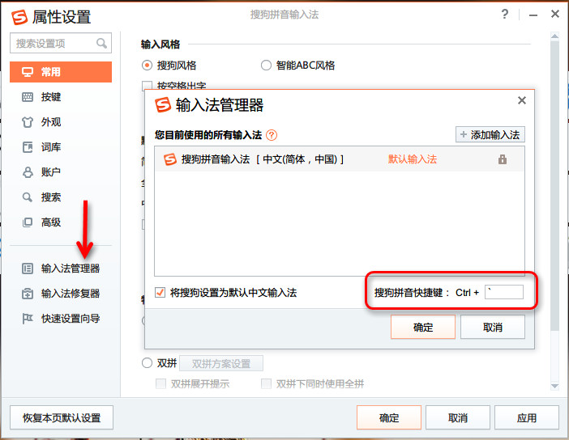
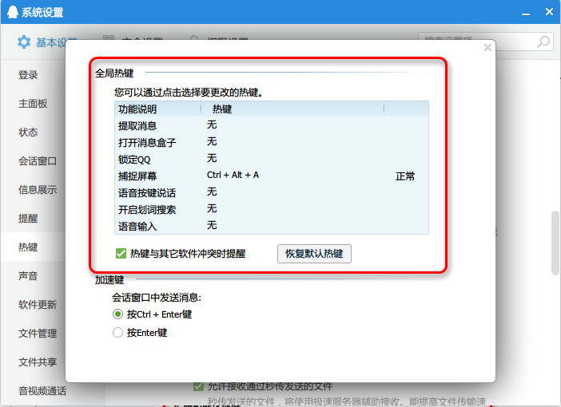
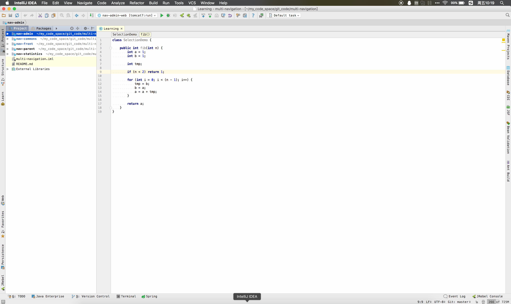
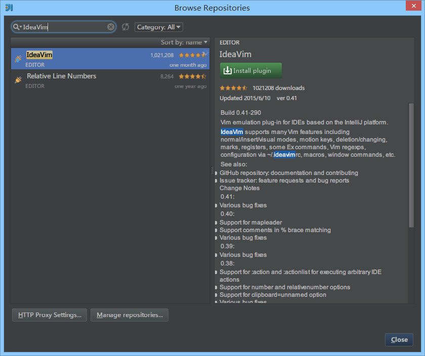

# 快捷键

## 说明

IntelliJ IDEA 的便捷操作性，快捷键的功劳占了一大半，对于各个快捷键组合请认真对待。IntelliJ IDEA 本身的设计思维是提倡键盘优先于鼠标的，所以各种快捷键组合层出不穷，对于快捷键设置也有各种支持，对于其他 IDE 的快捷键组合也有预设模板进行支持。

关于各个快捷键的频率分类上可能每个人都有各自的看法，下面的整理也只是以我个人的使用习惯来划分的，而我应该是可以代表某一部分小众人员。但是我个人还是强烈建议你可以在我的基础上整理一份属于你的快捷键目录（删除掉多余的字眼，只保留快捷键内容），本篇文章也只是起到一个工具和引子的作用。

对于下面各个快捷键的使介绍描述也许用我个人语言翻译起来不够准确或是不全面，且在不同的文件类型上按出来的效果也可能结果不太一样,所以 **强烈建议** 你自己把各个快捷键都亲自操作下体会下各个快捷键的实际用法。

## 前提

由于文化的不同，我们使用的电脑必备一个软件就是中文输入法，而目前大多数人都使用搜狗拼音输入法或是其他类似的。而这些输入法跟 IntelliJ IDEA 有一个万恶的冲突永恒不变：快捷键冲突。所以为了配合 IntelliJ IDEA，我们要去掉这些输入法下的所有快捷键。

> * 如上图红色圈住内容所示，默认是 `逗号` 我改为了 ESC 键下的 `波浪号`，`Ctrl + 逗号` 这个快捷键适合做智能提示用，下面的快捷键列表会讲。

> * 如上图红色圈住内容所示，这些快捷键很容易跟 IntelliJ IDEA 快捷键冲突，需要全部去掉。

> * 如上图红色圈住内容所示，QQ 这些快捷键也很容易跟 IntelliJ IDEA 快捷键冲突，需要全部去掉，最多保持一个截图功能即可。

可能还有其他一些软件，比如网易云音乐、有道词典等等这些软件都可能存在快捷键冲突，所以为了 IntelliJ IDEA 这些软件的快捷键都是值得舍弃的，如果你在开发的时候。

> * IntelliJ IDEA 官方出的学习辅助插件：IDE Features Trainer：<https://plugins.jetbrains.com/plugin/8554?pr=idea>

## Ctrl

|快捷键|介绍|
|:---------|:---------|
|Ctrl + F|在当前文件进行文本查找 `（必备）` |
|Ctrl + R|在当前文件进行文本替换 `（必备）` |
|Ctrl + Z|撤销 `（必备）` |
|Ctrl + Y|删除光标所在行 或 删除选中的行 `（必备）` |
|Ctrl + X|剪切光标所在行 或 剪切选择内容|
|Ctrl + C|复制光标所在行 或 复制选择内容|
|Ctrl + D|复制光标所在行 或 复制选择内容，并把复制内容插入光标位置下面 `（必备）` |
|Ctrl + W|递进式选择代码块。可选中光标所在的单词或段落，连续按会在原有选中的基础上再扩展选中范围 `（必备）` |
|Ctrl + E|显示最近打开的文件记录列表 `（必备）` |
|Ctrl + N|根据输入的 **类名** 查找类文件 `（必备）` |
|Ctrl + G|在当前文件跳转到指定行处|
|Ctrl + J|插入自定义动态代码模板 `（必备）` |
|Ctrl + P|方法参数提示显示 `（必备）` |
|Ctrl + Q|光标所在的变量 / 类名 / 方法名等上面（也可以在提示补充的时候按），显示文档内容|
|Ctrl + U|前往当前光标所在的方法的父类的方法 / 接口定义 `（必备）` |
|Ctrl + B|进入光标所在的方法/变量的接口或是定义处，等效于 `Ctrl + 左键单击`  `（必备）` |
|Ctrl + K|版本控制提交项目，需要此项目有加入到版本控制才可用|
|Ctrl + T|版本控制更新项目，需要此项目有加入到版本控制才可用|
|Ctrl + H|显示当前类的层次结构|
|Ctrl + O|选择可重写的方法|
|Ctrl + I|选择可继承的方法|
|Ctrl + \+|展开代码|
|Ctrl + \-|折叠代码|
|Ctrl + /|注释光标所在行代码，会根据当前不同文件类型使用不同的注释符号 `（必备）` |
|Ctrl + \[|移动光标到当前所在代码的花括号开始位置|
|Ctrl + \]|移动光标到当前所在代码的花括号结束位置|
|Ctrl + F1|在光标所在的错误代码处显示错误信息 `（必备）` |
|Ctrl + F3|调转到所选中的词的下一个引用位置 `（必备）` |
|Ctrl + F4|关闭当前编辑文件|
|Ctrl + F8|在 Debug 模式下，设置光标当前行为断点，如果当前已经是断点则去掉断点|
|Ctrl + F9|执行 Make Project 操作|
|Ctrl + F11|选中文件 / 文件夹，使用助记符设定 / 取消书签 `（必备）` |
|Ctrl + F12|弹出当前文件结构层，可以在弹出的层上直接输入，进行筛选|
|Ctrl + Tab|编辑窗口切换，如果在切换的过程又加按上delete，则是关闭对应选中的窗口|
|Ctrl + End|跳到文件尾|
|Ctrl + Home|跳到文件头|
|Ctrl + Space|基础代码补全，默认在 Windows 系统上被输入法占用，需要进行修改，建议修改为 `Ctrl + 逗号` `（必备）` |
|Ctrl + Delete|删除光标后面的单词或是中文句 `（必备）` |
|Ctrl + BackSpace|删除光标前面的单词或是中文句 `（必备）` |
|Ctrl + 1,2,3...9|定位到对应数值的书签位置 `（必备）` |
|Ctrl + 左键单击|在打开的文件标题上，弹出该文件路径 `（必备）` |
|Ctrl + 光标定位|按 Ctrl 不要松开，会显示光标所在的类信息摘要|
|Ctrl + 左方向键|光标跳转到当前单词 / 中文句的左侧开头位置 `（必备）` |
|Ctrl + 右方向键|光标跳转到当前单词 / 中文句的右侧开头位置 `（必备）` |
|Ctrl + 前方向键|等效于鼠标滚轮向前效果 `（必备）` |
|Ctrl + 后方向键|等效于鼠标滚轮向后效果 `（必备）` |

## Alt

|快捷键|介绍|
|:---------|:---------|
|Alt + \`|显示版本控制常用操作菜单弹出层 `（必备）` |
|Alt + Q|弹出一个提示，显示当前类的声明 / 上下文信息|
|Alt + F1|显示当前文件选择目标弹出层，弹出层中有很多目标可以进行选择 `（必备）` |
|Alt + F2|对于前面页面，显示各类浏览器打开目标选择弹出层|
|Alt + F3|选中文本，逐个往下查找相同文本，并高亮显示|
|Alt + F7|查找光标所在的方法 / 变量 / 类被调用的地方|
|Alt + F8|在 Debug 的状态下，选中对象，弹出可输入计算表达式调试框，查看该输入内容的调试结果|
|Alt + Home|定位 / 显示到当前文件的 `Navigation Bar` |
|Alt + Enter|IntelliJ IDEA 根据光标所在问题，提供快速修复选择，光标放在的位置不同提示的结果也不同 `（必备）` |
|Alt + Insert|代码自动生成，如生成对象的 set / get 方法，构造函数，toString() 等 `（必备）` |
|Alt + 左方向键|切换当前已打开的窗口中的子视图，比如Debug窗口中有Output、Debugger等子视图，用此快捷键就可以在子视图中切换 `（必备）` |
|Alt + 右方向键|按切换当前已打开的窗口中的子视图，比如Debug窗口中有Output、Debugger等子视图，用此快捷键就可以在子视图中切换 `（必备）` |
|Alt + 前方向键|当前光标跳转到当前文件的前一个方法名位置 `（必备）` |
|Alt + 后方向键|当前光标跳转到当前文件的后一个方法名位置 `（必备）` |
|Alt + 1,2,3...9|显示对应数值的选项卡，其中 1 是 Project 用得最多 `（必备）` |

## Shift

|快捷键|介绍|
|:---------|:---------|
|Shift + F1|如果有外部文档可以连接外部文档|
|Shift + F2|跳转到上一个高亮错误 或 警告位置|
|Shift + F3|在查找模式下，查找匹配上一个|
|Shift + F4|对当前打开的文件，使用新Windows窗口打开，旧窗口保留|
|Shift + F6|对文件 / 文件夹 重命名|
|Shift + F7|在 Debug 模式下，智能步入。断点所在行上有多个方法调用，会弹出进入哪个方法|
|Shift + F8|在 Debug 模式下，跳出，表现出来的效果跟 `F9` 一样|
|Shift + F9|等效于点击工具栏的 `Debug` 按钮|
|Shift + F10|等效于点击工具栏的 `Run` 按钮|
|Shift + F11|弹出书签显示层 `（必备）` |
|Shift + Tab|取消缩进 `（必备）` |
|Shift + ESC|隐藏当前 或 最后一个激活的工具窗口|
|Shift + End|选中光标到当前行尾位置|
|Shift + Home|选中光标到当前行头位置|
|Shift + Enter|开始新一行。光标所在行下空出一行，光标定位到新行位置 `（必备）` |
|Shift + 左键单击|在打开的文件名上按此快捷键，可以关闭当前打开文件 `（必备）` |
|Shift + 滚轮前后滚动|当前文件的横向滚动轴滚动 `（必备）` |

## Ctrl + Alt

|快捷键|介绍|
|:---------|:---------|
|Ctrl + Alt + L|格式化代码，可以对当前文件和整个包目录使用 `（必备）` |
|Ctrl + Alt + O|优化导入的类，可以对当前文件和整个包目录使用 `（必备）` |
|Ctrl + Alt + I|光标所在行 或 选中部分进行自动代码缩进，有点类似格式化|
|Ctrl + Alt + T|对选中的代码弹出环绕选项弹出层 `（必备）` |
|Ctrl + Alt + J|弹出模板选择窗口，将选定的代码加入动态模板中|
|Ctrl + Alt + H|调用层次|
|Ctrl + Alt + B|在某个调用的方法名上使用会跳到具体的实现处，可以跳过接口|
|Ctrl + Alt + V|快速引进变量|
|Ctrl + Alt + Y|同步、刷新|
|Ctrl + Alt + S|打开 IntelliJ IDEA 系统设置 `（必备）` |
|Ctrl + Alt + F7|显示使用的地方。寻找被该类或是变量被调用的地方，用弹出框的方式找出来|
|Ctrl + Alt + F11|切换全屏模式|
|Ctrl + Alt + Enter|光标所在行上空出一行，光标定位到新行 `（必备）` |
|Ctrl + Alt + Home|弹出跟当前文件有关联的文件弹出层|
|Ctrl + Alt + Space|类名自动完成|
|Ctrl + Alt + 左方向键|退回到上一个操作的地方 `（必备）` |
|Ctrl + Alt + 右方向键|前进到上一个操作的地方 `（必备）` |
|Ctrl + Alt + 前方向键|在查找模式下，跳到上个查找的文件|
|Ctrl + Alt + 后方向键|在查找模式下，跳到下个查找的文件|

## Ctrl + Shift

|快捷键|介绍|
|:---------|:---------|
|Ctrl + Shift + F|根据输入内容查找整个项目 或 指定目录内文件 `（必备）` |
|Ctrl + Shift + R|根据输入内容替换对应内容，范围为整个项目 或 指定目录内文件 `（必备）` |
|Ctrl + Shift + J|自动将下一行合并到当前行末尾 `（必备）` |
|Ctrl + Shift + Z|取消撤销 `（必备）` |
|Ctrl + Shift + W|递进式取消选择代码块。可选中光标所在的单词或段落，连续按会在原有选中的基础上再扩展取消选中范围 `（必备）` |
|Ctrl + Shift + N|通过文件名定位 / 打开文件 / 目录，打开目录需要在输入的内容后面多加一个正斜杠 `（必备）` |
|Ctrl + Shift + U|对选中的代码进行大 / 小写轮流转换 `（必备）` |
|Ctrl + Shift + T|对当前类生成单元测试类，如果已经存在的单元测试类则可以进行选择 `（必备）` |
|Ctrl + Shift + C|复制当前文件磁盘路径到剪贴板 `（必备）` |
|Ctrl + Shift + V|弹出缓存的最近拷贝的内容管理器弹出层|
|Ctrl + Shift + E|显示最近修改的文件列表的弹出层|
|Ctrl + Shift + H|显示方法层次结构|
|Ctrl + Shift + B|跳转到类型声明处 `（必备）` |
|Ctrl + Shift + I|快速查看光标所在的方法 或 类的定义|
|Ctrl + Shift + A|查找动作 / 设置|
|Ctrl + Shift + /|代码块注释 `（必备）` |
|Ctrl + Shift + \[|选中从光标所在位置到它的顶部中括号位置 `（必备）` |
|Ctrl + Shift + \]|选中从光标所在位置到它的底部中括号位置 `（必备）` |
|Ctrl + Shift + \+|展开所有代码 `（必备）` |
|Ctrl + Shift + \-|折叠所有代码 `（必备）` |
|Ctrl + Shift + F7|高亮显示所有该选中文本，按Esc高亮消失 `（必备）` |
|Ctrl + Shift + F8|在 Debug 模式下，指定断点进入条件|
|Ctrl + Shift + F9|编译选中的文件 / 包 / Module|
|Ctrl + Shift + F12|编辑器最大化 `（必备）` |
|Ctrl + Shift + Space|智能代码提示|
|Ctrl + Shift + Enter|自动结束代码，行末自动添加分号 `（必备）` |
|Ctrl + Shift + Backspace|退回到上次修改的地方 `（必备）` |
|Ctrl + Shift + 1,2,3...9|快速添加指定数值的书签 `（必备）` |
|Ctrl + Shift + 左键单击|把光标放在某个类变量上，按此快捷键可以直接定位到该类中 `（必备）` |
|Ctrl + Shift + 左方向键|在代码文件上，光标跳转到当前单词 / 中文句的左侧开头位置，同时选中该单词 / 中文句 `（必备）` |
|Ctrl + Shift + 右方向键|在代码文件上，光标跳转到当前单词 / 中文句的右侧开头位置，同时选中该单词 / 中文句 `（必备）` |
|Ctrl + Shift + 前方向键|光标放在方法名上，将方法移动到上一个方法前面，调整方法排序 `（必备）` |
|Ctrl + Shift + 后方向键|光标放在方法名上，将方法移动到下一个方法前面，调整方法排序 `（必备）` |

## Alt + Shift

|快捷键|介绍|
|:---------|:---------|
|Alt + Shift + N|选择 / 添加 task `（必备）` |
|Alt + Shift + F|显示添加到收藏夹弹出层 / 添加到收藏夹|
|Alt + Shift + C|查看最近操作项目的变化情况列表|
|Alt + Shift + I|查看项目当前文件|
|Alt + Shift + F7|在 Debug 模式下，下一步，进入当前方法体内，如果方法体还有方法，则会进入该内嵌的方法中，依此循环进入|
|Alt + Shift + F9|弹出 `Debug`  的可选择菜单|
|Alt + Shift + F10|弹出 `Run`  的可选择菜单|
|Alt + Shift + 左键双击|选择被双击的单词 / 中文句，按住不放，可以同时选择其他单词 / 中文句 `（必备）` |
|Alt + Shift + 前方向键|移动光标所在行向上移动 `（必备）` |
|Alt + Shift + 后方向键|移动光标所在行向下移动 `（必备）` |

## Ctrl + Shift + Alt

|快捷键|介绍|
|:---------|:---------|
|Ctrl + Shift + Alt + V|无格式黏贴 `（必备）` |
|Ctrl + Shift + Alt + N|前往指定的变量 / 方法|
|Ctrl + Shift + Alt + S|打开当前项目设置 `（必备）` |
|Ctrl + Shift + Alt + C|复制参考信息|

## 其他

|快捷键|介绍|
|:---------|:---------|
|F2|跳转到下一个高亮错误 或 警告位置 `（必备）` |
|F3|在查找模式下，定位到下一个匹配处|
|F4|编辑源 `（必备）` |
|F7|在 Debug 模式下，进入下一步，如果当前行断点是一个方法，则进入当前方法体内，如果该方法体还有方法，则不会进入该内嵌的方法中|
|F8|在 Debug 模式下，进入下一步，如果当前行断点是一个方法，则不进入当前方法体内|
|F9|在 Debug 模式下，恢复程序运行，但是如果该断点下面代码还有断点则停在下一个断点上|
|F11|添加书签 `（必备）` |
|F12|回到前一个工具窗口 `（必备）` |
|Tab|缩进 `（必备）` |
|ESC|从工具窗口进入代码文件窗口 `（必备）` |
|连按两次Shift|弹出 `Search Everywhere` 弹出层|

## 官网快捷键资料

> * Windows / Linux：<https://www.jetbrains.com/idea/docs/IntelliJIDEA_ReferenceCard.pdf>
> * Mac OS X：<https://www.jetbrains.com/idea/docs/IntelliJIDEA_ReferenceCard_Mac.pdf>

## 第三方快捷键资料

> * 来自 eta02913：<http://xinyuwu.iteye.com/blog/1005454>

## 快捷键修改

> * 按 `Ctrl + Alt + S` 弹出 IDE 设置，如上图选择左侧的 `Keymap`。
> * IntelliJ IDEA 支持两种方式来筛选我们要找的快捷键，一种是上图标注 1 所示的，通过输入快捷键描述内容；一种是上图标注 2 所示的，通过 **按** 指定快捷键快捷键，这里需要再次强调的是，这个输入框是自动监听你当前按下的按键，而不是用来输入的。
> * 上图标注 3 所示，初安装的 IntelliJ IDEA 使用的是 `Default` 的快捷键模板，IntelliJ IDEA 默认的快捷键模板都是不可修改的。如果你直接修改，当前这个位置 IntelliJ IDEA 会自动变成 `Default Copy`，建议你养成习惯，修改之前先点击 `Copy`，拷贝一套快捷键模板，然后输入自己的命名。

> * IntelliJ IDEA 是支持一个操作命令同时设置多个快捷键组合，就如上图的 `Backspace`，同时支持 `Backspace` 和 `Shift + Backspace` 两组快捷键。
> * 要修改某个快捷键，选中快捷键介绍内容，右键，就会弹出如上图标注 1 所示操作选择。
> * 命令 `Add Keyboard Shortcut` 用来添加新纯键盘快捷键组合。
> * 命令 `Add Mouse Shortcut` 用来添加新 `键盘 + 鼠标` 快捷键组合，比如设置 `Ctrl + 左键单击` 这类快捷组合。其中在弹出的添加面板中 `Click Pad` 是用来监听当前鼠标是左键单击还是右键单击。
> * 命令 `Add Abbreviation` 根据 IntelliJ IDEA 的版本文档解释，添加简称主要是为了方便 `Search Everywhere` 中使用，但是我尝试之后发现没办法根据我设置的简称搜索，暂时无法了解其作用。 
> * 命令 `Remove 快捷键` 移出当前操作命令已设置的快捷键组合，由于 IntelliJ IDEA 默认就占用了很多快捷键组合，所以如果你要修改某个快捷键，建议还是删除掉旧的。 

> * IntelliJ IDEA 对其他 IDE 用户很友好，如上图对于其他主流的 IDE，快捷键上已经默认了有其过度快捷键模板了，但是我还是建议你专心使用 IntelliJ IDEA 的默认。

## 其他

> * 如果你是一个 Vim 粉，IntelliJ IDEA 也为你准备了一个方案：如上图安装 IdeaVim 插件即可。
