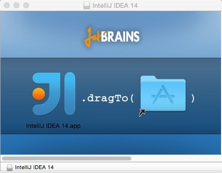

# Mac 系统下安装 IntelliJ IDEA

## 系统要求

> * 系统支持：Mac OS X 10.5 以上
> * JDK 版本：Apple Java 6 或 Oracle Java 7 以上
> * 内存：最低要求 1 G，推荐 2 G 以上
> * 硬盘：最低要求 2 G
> * 显示器：最低要求 1024 X 768 分辨率
> * 更多信息可以阅读：<https://www.jetbrains.com/help/idea/install-and-set-up-intellij-idea.html>

## 重要说明

我这里以 Mac 系统为例进行讲解。但是，在学习下面内容之前请先看下章节：[Windows 下安装](windows-install.md)

因为它们配置流程是基本一样的，只是系统不同，开始的步骤不太一样而已，因此相同部分我这里是不会再讲的，我只讲 IntelliJ IDEA 在 Mac 安装特殊的地方。

## Mac 下安装过程

> * 运行下载到 `ideaIU-14.1.4.dmg`，效果如上图所示。
> * 根据提示把左侧的 IntelliJ IDEA 图标拖动到右侧目录图

> * 拖动完成之后即可在 `应用程序` 中看到 IntelliJ IDEA 的启动图标，点击运行即可。

## Mac 修改运行 JDK 版本

- **目前的最新 IntelliJ IDEA 版本已经默认都是使用它自己带的 JDK 环境，所以这个已经不需要再设置了。**

> * 如果你的 Mac 安装有多个 JDK，你想使用高版本的 JDK 运行 IntelliJ IDEA 可以按如下方式进行修改：
> * 在 `应用程序` 中找到 `IntelliJ IDEA.app` 然后对此进行 `右键 > 显示包内容 > Contents > Info.plist`，效果如上图所示。
> * 找到上图红圈标注的代码，修改 `JVMVersion` 的属性值，如果是 JDK 7，则改为 `1.7*`。如果是 JDK 8，则改为 `1.8*`。

## Mac 下启动 Tomcat 报 Permission denied

- 这个表示你对你的 Tomcat 目录是没有足够权限的，简单粗暴的方式是你可以把你整个 Tomcat 的 bin 目录都改为 777 的权限
    - 打开终端，进入 Tomcat\bin 目录，然后执行： `chmod 777 *.sh`
