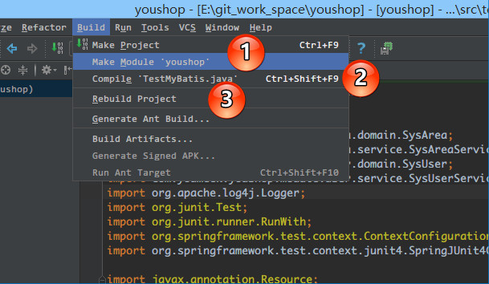
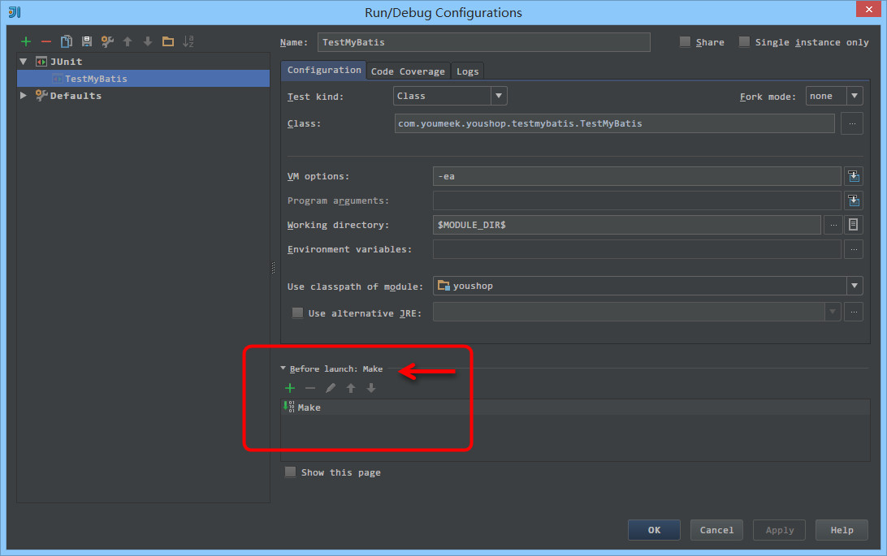
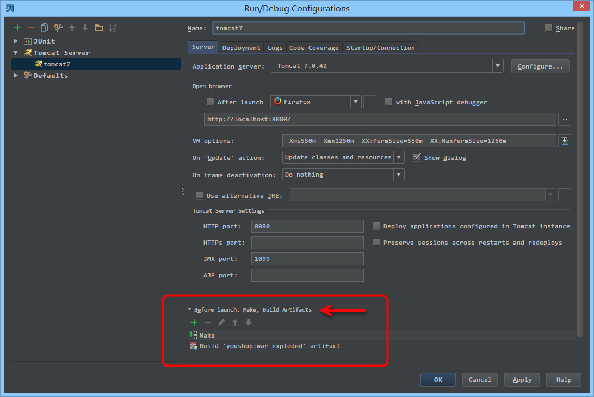
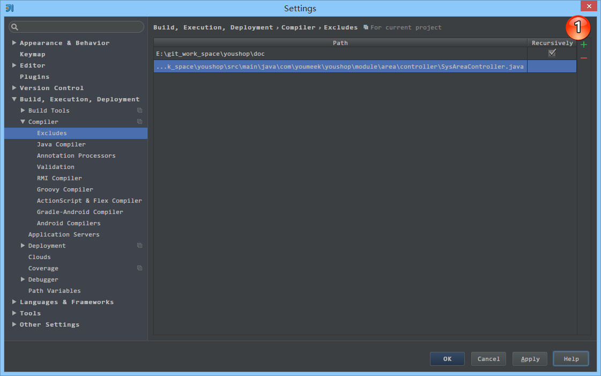

# IntelliJ IDEA 编译方式介绍

## 编译方式介绍 

相比较于 Eclipse 的实时自动编译，IntelliJ IDEA 的编译更加手动化，虽然 IntelliJ IDEA 也支持通过设置开启实时编译，但是不建议，因为太占资源了。IntelliJ IDEA 编译方式除了手工点击编译按钮进行编译之外，还有就是在容器运行之前配置上一个编译事件，先编译后运行。默认下 IntelliJ IDEA 也都是这样的设置，所以实际开发中你也不用太注意编译这件事。虽然 IntelliJ IDEA 没有实时编译，但是对于代码检查完全是没有影响。但是多个类之间的关联关系还是要等 Make 或 Rebuild 触发的时候才会做相关检查的。

在 IntelliJ IDEA 里，编译方式一共有三种：
> * Compile：对选定的目标（Java 类文件），进行强制性编译，不管目标是否是被修改过。注：2018版操作为Recompile。
> * Rebuild：对选定的目标（Project），进行强制性编译，不管目标是否是被修改过，由于 Rebuild 的目标只有 Project，所以 Rebuild 每次花的时间会比较长。
> * Make：使用最多的编译操作。对选定的目标（Project 或 Module）进行编译，但只编译有修改过的文件，没有修改过的文件不会编译，这样平时开发大型项目才不会浪费时间在编译过程中。注：2018版操作为Build。

## 编译触发按钮

> * 如上图标注 1 所示，Make 的操作有：`Make Project`、`Make Module`
> * 如上图标注 2 所示，Compile 的操作有：`Compile` 指定类
> * 如上图标注 3 所示，Rebuild 的操作有：`Rebuild Project`

## 运行之前的编译
 

> * 如上图所示，IntelliJ IDEA 默认在运行 JUnit 之前会先进行 `Make` 操作。

> * 如上图所示，IntelliJ IDEA 默认在运行 tomcat 之前会先进行 `Make` 操作。

## 编译器的设置和选择

> * 上图标注 1 所示，也是我们本文前面讲的，IntelliJ IDEA 是支持自动编译的，默认是不开启的，也建议不用开启，原因前面已经说了。
> * 上图标注 2 所示，设置编译 `heap` 大小，默认是 `700`，建议使用 64 位的用户，在内存足够的情况下，建议改为 `1500` 或以上。如果你在编译的时候出错，报：`OutOfMemoryError`，一般也是要来改这个地方。
> * 上图标注 3 所示，还可以设置编译时的 `VM` 参数，这个你可以根据需求进行设置，一般人是用不上的。

> * 如上图标注 1 所示，可以添加目录 或 文件进行编译排除。
> * 在项目中，如果有任何一个可编译的文件无法编译通过，则 IntelliJ IDEA 是无法运行起来的，必须等你全部问题解决，编译通过之后才可运行。但是可能开发过程中，某一个包目录的文件编译无法通过，但是我们又不急着改，那我们就可以考虑把该包加入到排除编译列表中，则项目就可以运行起来。

> * 如上图动态 Gif 所示，IntelliJ IDEA 支持常见的几种编译器：`Javac`、`Eclipse`、`Ajc` 等。默认是 `Javac`，也推荐使用 `Javac`。
> * `Project bytecode version` 针对项目字节码编译版本，一般选择的是当前项目主 JDK 的版本。
> * `Per-module bytecode version` 可以针对 `Project` 下各个 `Module` 的特殊需求单独设置不同的 `bytecode version`，前提是电脑上必须有安装对应的 JDK 版本。
