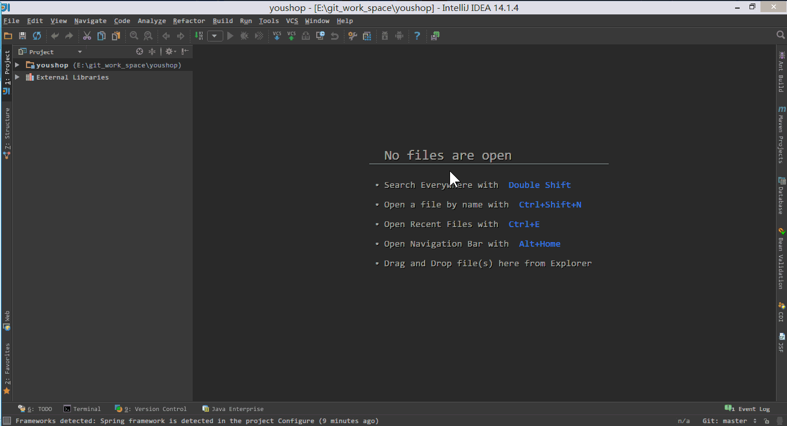
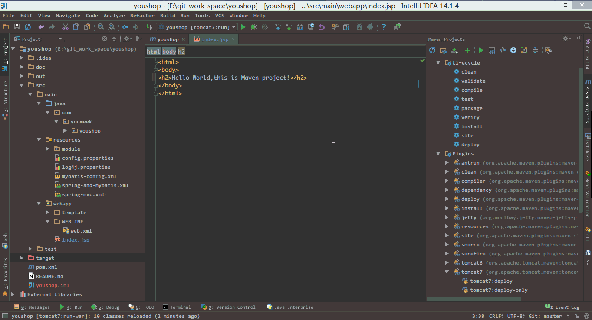

# Maven 项目介绍

## 学习前提

相对于传统的项目，Maven 下管理和构建的项目真的非常好用和简单，所以这里也强调下，尽量使用此类工具进行项目构建。

学习本讲还有一个前提：你必须会 Maven 相关知识点，Maven 相关知识点是不在本专题的讲解范围里面的，所以请自己私下进行学习。如果愿意你也可以看我过去整理的一份视频（提取码：wh5g）：<http://pan.baidu.com/s/1eSovBkI>

## Maven 常用设置介绍

> * 如上图标注 1 所示，我们可以指定我们本地 Maven 的安装目录所在，因为我已经配置了 `MAVEN_HOME` 系统参数，所以直接这样配置 IntelliJ IDEA 是可以找到的。但是假如你没有配置的话，这里可以选择你的 Maven 安装目录。
> * 如上图标注 2 所示，我们还可以指定 Maven 的 `settings.xml` 位置和本地仓库位置。

> * 如上图标注 1 所示，`Import Maven projects automatically` 表示 IntelliJ IDEA 会实时监控项目的 `pom.xml` 文件，进行项目变动设置。
> * 如上图标注 2 所示，在 Maven 导入依赖包的时候是否自动下载源码和文档。默认是没有勾选的，也不建议勾选，原因是这样可以加快项目从外网导入依赖包的速度，如果我们需要源码和文档的时候我们到时候再针对某个依赖包进行联网下载即可。IntelliJ IDEA 支持直接从公网下载源码和文档的。
> * 如上图标注 3 所示，可以设置导入的 VM 参数。一般这个都不需要主动改，除非项目真的导入太慢了我们再增大此参数。

## Maven 骨架创建 Java Web 项目

> * 如上图 Gif 演示，根据已有的 Maven 骨架进行 Java Web 项目创建。其中需要特别注意的是，在创建项目过程中 Maven 会去外网中央仓库中下载对应的依赖或是组件，这个过程根据自身网络环境决定其快慢。如果出现无法下载的情况请自备 VPN 或者通过修改 Maven 配置文件 `settings.xml` 切换国内的中央仓库。
> * 由于我已经试过多次了，所以 Gif 演示中我可以快速创建好，但是你那边不一定是这种情况的。

## 启动 Java Web 项目

> * 如上图 Gif 演示，配置好项目之后，启动 Tomcat 容器可以良好运行。

## Maven 组件来管理项目

我们已经了解了如何通过 Maven 骨架生成一个最简单的 Java Web 项目，可是我们还是使用了 IntelliJ IDEA 的项目管理功能进行 Maven 项目的管理和构建。一般 Maven 的项目我们都可以脱离 IntelliJ IDEA 的项目配置功能进行独立的管理和构建的，接下来我们就讲如何通过 IntelliJ IDEA 提供的 Maven 管理工具进行项目的管理和构建。

## Maven 组件界面介绍

> * 如上图标注 1 所示，为常用的 Maven 工具栏，其中最常用的有：
>> * 第一个按钮：`Reimport All Maven Projects` 表示根据 `pom.xml` 重新载入项目。一般当我们在 `pom.xml` 添加了依赖包或是插件的时候，发现标注 4 的依赖区中没有看到最新写的依赖的话，可以尝试点击此按钮进行项目的重新载入。
>> * 第六个按钮：`Execute Maven Goal` 弹出可执行的 Maven 命令的输入框。有些情况下我们需要通过书写某些执行命令来构建项目，就可以通过此按钮。
>> * 第九个按钮：`Show Dependencies` 显示项目依赖的结构图，可以方便我们直观项目的依赖包情况。这个功能有些具体的操作下面会专门进行讲解。

> * 如上图标注 2 所示，常用的 Maven 生命周期的命令，通过双击对应的命令来执行项目编译、打包、部署等操作。

> * 如上图标注 3 所示，为我们在 `pom.xml` 中配置的插件列表，方便调用插件。

> * 如上图标注 4 所示，为我们在 `pom.xml` 中配置的依赖包列表。

> * 如上图标注 5 所示，为常见的 Java Web 在 Maven 下的一个项目结构。

## Maven 的 Tomcat 插件运行项目

> * 如上图 Gif 演示，通过 Maven 生命周期的命令进行编译和打包，及用 Maven 的 Tomcat 插件运行项目。
> * 虽然我们可以通过 Maven 组件进行项目的管理，但是这并不等同于我们可以完全抛弃 IntelliJ IDEA 的项目设置，比如我们在 `pom.xml` 文件中设置了 JDK 编译版本是 1.7，但是在项目的 `Ctrl + Shift + Alt + S` 配置中，我们配置的 JDK 是 1.8，那即使我们用 Maven 的编译工具或命令进行编译也是会调用 1.8的。还有即使我们在 `Ctrl + Shift + Alt + S` 配置中没有配置 Artifacts，在我们运行 Maven 的 Tomcat 插件的时候也会自动帮我们生成的。

## Maven 快速排查依赖包冲突

> * 如上图箭头所示，点击此按钮会出现左边的项目依赖结构图，通过此图我们可以很好的观察项目的依赖依赖情况。
> * 如上图标注 1 所示，我们可以直接在依赖结构图上编辑依赖，常用的就是此排除功能。

> * 如上图描述，一般我们在出现红色线的时候是都要进行排除的，防止出现因为版本不同的依赖包造成代码无法编译。

