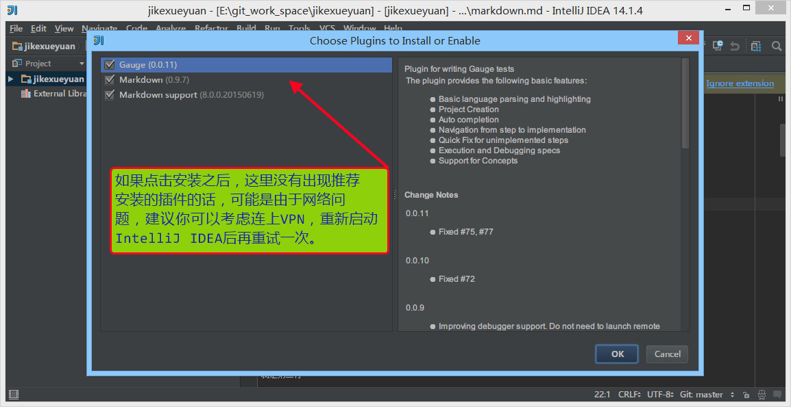
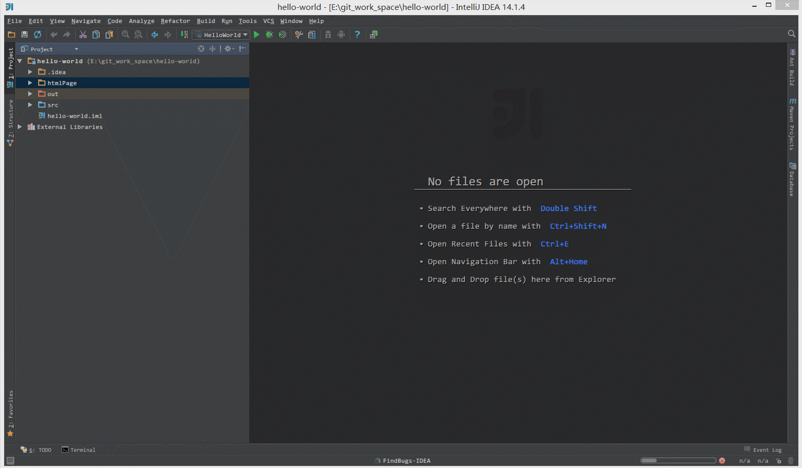

# 插件的使用

## 插件的设置

在 IntelliJ IDEA 的安装讲解中我们其实已经知道，IntelliJ IDEA 本身很多功能也都是通过插件的方式来实现的，只是 IntelliJ IDEA 本身就是它自己的插件平台最大的开发者而已，开发了很多优秀的插件。 

> * 官网插件库：<https://plugins.jetbrains.com/>

> * 如上图标注 1 所示，IntelliJ IDEA 对插件进行了很好的分类：
>
>> * `All plugins` 显示所有插件。 
>> * `Enabled` 显示当前所有已经启用的插件。
>> * `Disabled` 显示当期那所有已经禁用的插件。
>> * `Bundled` 显示所有 IntelliJ IDEA 自带的插件。
>> * `Custom` 显示所有我们自行安装的插件，如果你自己装了很多次插件的话，这个选项会用得比较多。
> * 如上图标注 2 所示，启用的插件是被勾选的，如果要禁用一个插件，去掉勾选即可。
> * 如上图标注 3 所示，弹出 IntelliJ IDEA 公司自行开发的插件仓库列表，供下载安装。
> * 如上图标注 4 所示，弹出插件仓库中所有插件列表供下载安装。
> * 如上图标注 5 所示，浏览本地的插件文件进行安装，而不是从服务器上下载并安装。
> * 需要严重注意的是：在国内的网络下，很经常出现显示不了插件列表，或是显示了插件列表，无法下载完成安装。这时候请自行开VPN，一般都可以得到解决。

> * 如上图红圈所示，如果 IntelliJ IDEA 打开一个它可以识别并且支持的文件类型，它会提示你它有对应的插件进行支持，你可以安装对应的插件来加以兼容此类文件。

## 插件的安装

> * 如上图 Gif 演示，在线安装 IntelliJ IDEA 插件库中的插件。

> * 如上图 Gif 演示，离线安装本地插件文件。

## 插件推荐

|插件名称    |插件介绍      |官网地址        |
|:-----------------|:----------|:--------------|
|Gitee|开源中国的码云插件|<https://plugins.jetbrains.com/plugin/8383-gitee>|
|Alibaba Java Coding Guidelines|阿里巴巴出的代码规范检查插件|https://plugins.jetbrains.com/plugin/10046-alibaba-java-coding-guidelines|
|IDE Features Trainer|IntelliJ IDEA 官方出的学习辅助插件|<https://plugins.jetbrains.com/plugin/8554?pr=idea>|
|Key promoter|快捷键提示|<https://plugins.jetbrains.com/plugin/4455?pr=idea>|
|Grep Console|自定义设置控制台输出颜色|<https://plugins.jetbrains.com/idea/plugin/7125-grep-console>|
|String Manipulation|驼峰式命名和下划线命名交替变化|<https://plugins.jetbrains.com/plugin/2162?pr=idea>|
|CheckStyle-IDEA|代码规范检查|<https://plugins.jetbrains.com/plugin/1065?pr=idea>|
|FindBugs-IDEA|潜在 Bug 检查|<https://plugins.jetbrains.com/plugin/3847?pr=idea>|
|MetricsReloaded|代码复杂度检查|<https://plugins.jetbrains.com/plugin/93?pr=idea>|
|Statistic|代码统计|<https://plugins.jetbrains.com/plugin/4509?pr=idea>|
|JRebel Plugin|热部署|<https://plugins.jetbrains.com/plugin/?id=4441>|
|CodeGlance|在编辑代码最右侧，显示一块代码小地图|<https://plugins.jetbrains.com/plugin/7275?pr=idea>|
|GsonFormat|把 JSON 字符串直接实例化成类|<https://plugins.jetbrains.com/plugin/7654?pr=idea>|
|Markdown Navigator|书写 Markdown 文章|<https://plugins.jetbrains.com/plugin/7896?pr=idea>|
|Eclipse Code Formatter|使用 Eclipse 的代码格式化风格，在一个团队中如果公司有规定格式化风格，这个可以使用。|<https://plugins.jetbrains.com/plugin/6546?pr=idea>|
|Jindent-Source Code Formatter|自定义类、方法、doc、变量注释模板|<http://plugins.jetbrains.com/plugin/2170?pr=idea>|
|Translation|翻译插件|<https://github.com/YiiGuxing/TranslationPlugin>|
|Maven Helper|Maven 辅助插件|<https://plugins.jetbrains.com/plugin/7179-maven-helper>|
|Properties to YAML Converter|把 Properties 的配置格式改为 YAML 格式|<https://plugins.jetbrains.com/plugin/8000-properties-to-yaml-converter>|
|Git Flow Integration|Git Flow 的图形界面操作|<https://plugins.jetbrains.com/plugin/7315-git-flow-integration>|
|Rainbow Brackets|对各个对称括号进行着色，方便查看|<https://github.com/izhangzhihao/intellij-rainbow-brackets>|
|MybatisX|mybatis 框架辅助（免费）|<https://plugins.jetbrains.com/plugin/10119-mybatisx>|
|Lombok Plugin|Lombok 功能辅助插件|<https://plugins.jetbrains.com/plugin/6317-lombok-plugin>|
|.ignore|各类版本控制忽略文件生成工具|<https://plugins.jetbrains.com/plugin/7495--ignore>|
|mongo4idea|mongo客户端|<https://github.com/dboissier/mongo4idea>|
|iedis|redis客户端|<https://plugins.jetbrains.com/plugin/9228-iedis>|
|GenerateAllSetter|new POJO类的快速生成 set 方法|<https://plugins.jetbrains.com/plugin/9360-generateallsetter>|

## lombok 插件的使用

- lombok 插件官网：<https://plugins.jetbrains.com/plugin/6317-lombok-plugin>
- 推荐 IntelliJ IDEA 插件库搜索安装：
	- <kbd>File</kbd> > <kbd>Settings</kbd> > <kbd>Plugins</kbd> > <kbd>Browse repositories...</kbd> > <kbd>Search for "lombok"</kbd> > <kbd>Install Plugin</kbd>
- IntelliJ IDEA 配置方法，官网有说明（该配置是 Project 级别，不是 IDE 全局的）：<https://github.com/mplushnikov/lombok-intellij-plugin#required-intellij-configuration>
