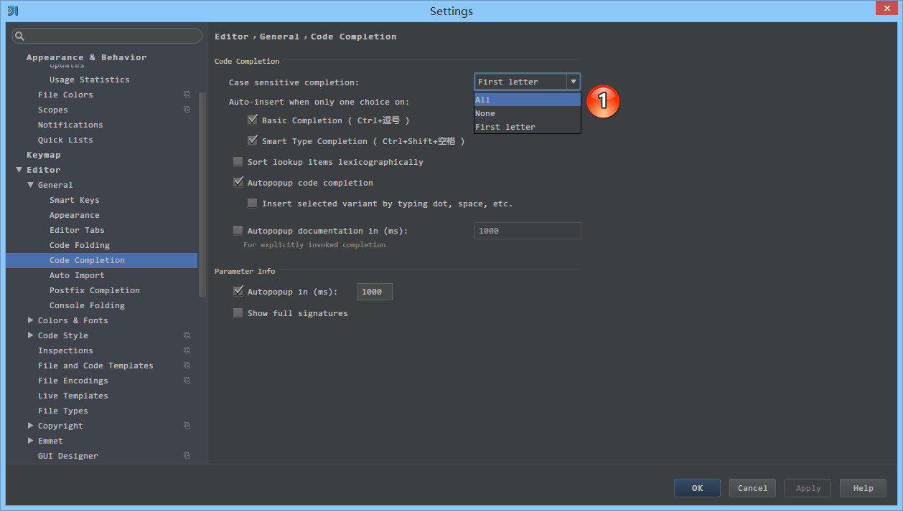
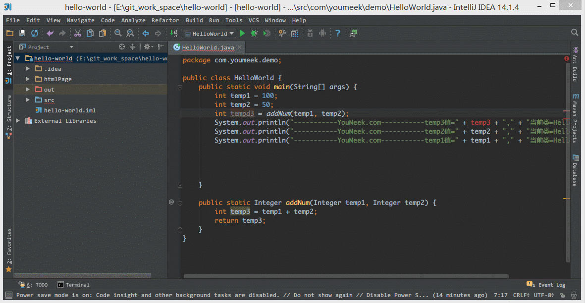
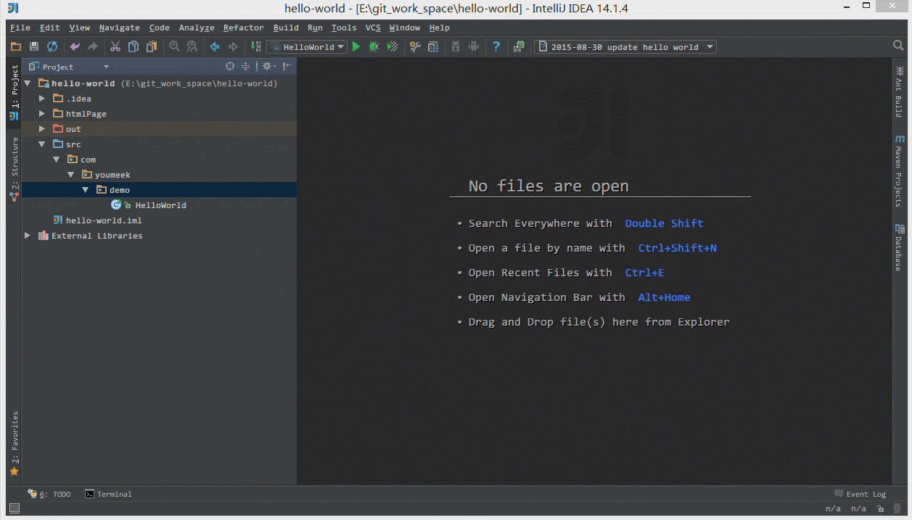
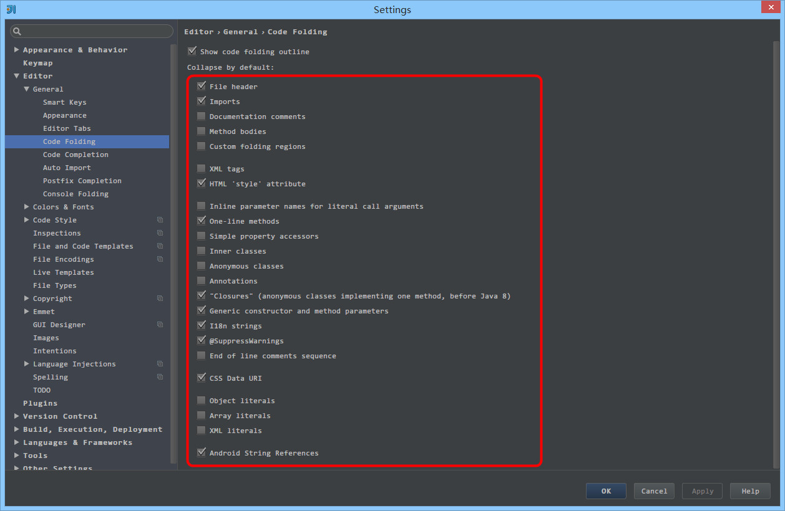
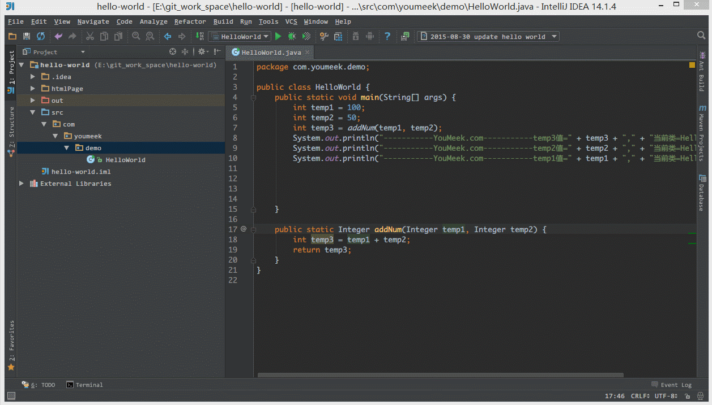
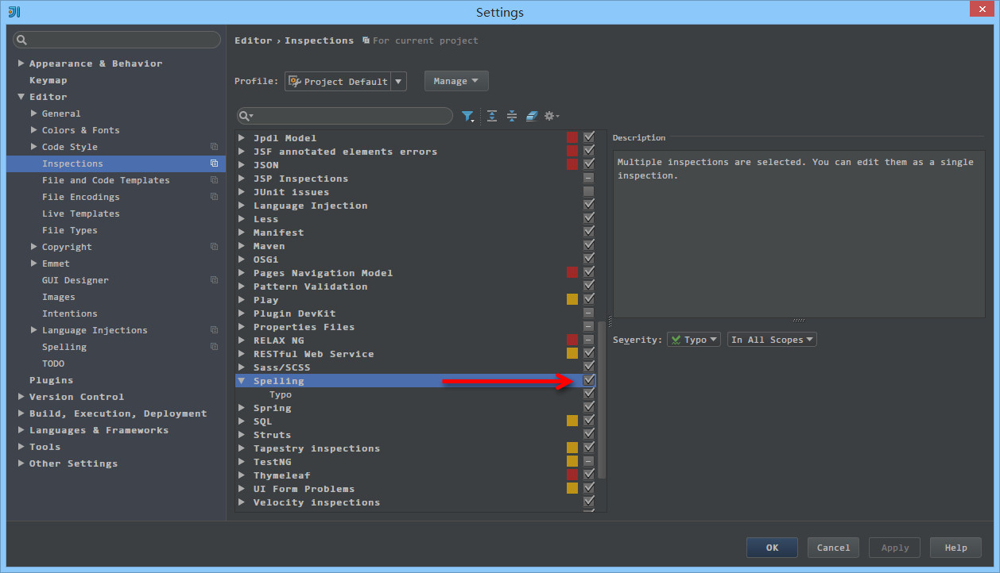
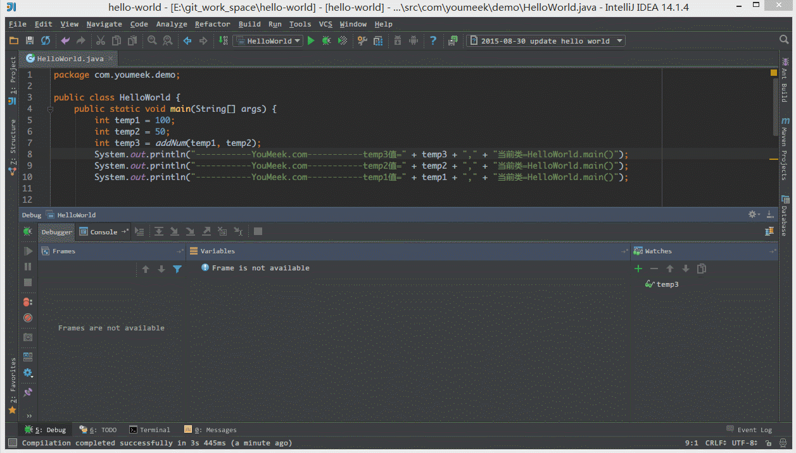
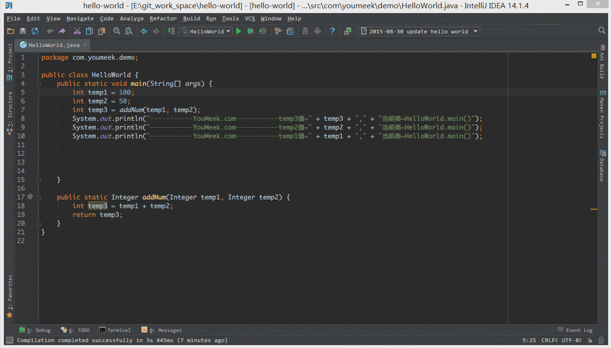
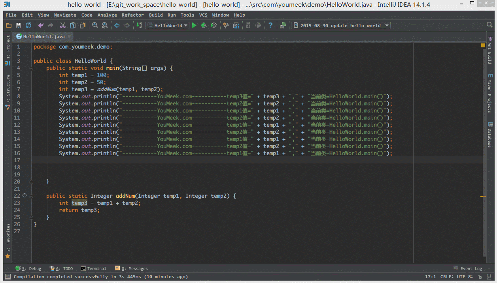
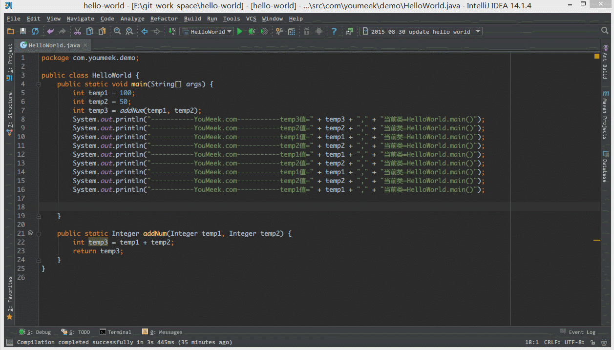

# IntelliJ IDEA 常用设置讲解

## 说明

IntelliJ IDEA 有很多人性化的设置我们必须单独拿出来讲解，也因为这些人性化的设置让我们这些 IntelliJ IDEA 死忠粉更加死心塌地使用它和分享它。

## 常用设置

> * IntelliJ IDEA 的代码提示和补充功能有一个特性：区分大小写。如上图标注 1 所示，默认就是 `First letter` 区分大小写的。
> * 区分大小写的情况是这样的：比如我们在 Java 代码文件中输入 `stringBuffer` IntelliJ IDEA 是不会帮我们提示或是代码补充的，但是如果我们输入 `StringBuffer` 就可以进行代码提示和补充。
> * 如果想不区分大小写的话，改为 `None` 选项即可。

> * 如上图 Gif 所示，该功能用来快速设置代码检查等级。我个人一般在编辑大文件的时候会使用该功能。IntelliJ IDEA 对于编辑大文件并没有太大优势，很卡，原因就是它有各种检查，这样是非常耗内存和 CPU 的，所以为了能加快大文件的读写，我一般会暂时性设置为 `None`。

>> * `Inspections` 为最高等级检查，可以检查单词拼写，语法错误，变量使用，方法之间调用等。
>> * `Syntax` 可以检查单词拼写，简单语法错误。
>> * `None` 不设置检查。 

> * 如上图标注 1 和 2 所示，默认 IntelliJ IDEA 是没有开启自动 import 包的功能。

>> * 勾选标注 1 选项，IntelliJ IDEA 将在我们书写代码的时候自动帮我们优化导入的包，比如自动去掉一些没有用到的包。
>> * 勾选标注 2 选项，IntelliJ IDEA 将在我们书写代码的时候自动帮我们导入需要用到的包。但是对于那些同名的包，还是需要手动 `Alt + Enter` 进行导入的，IntelliJ IDEA 目前还无法智能到替我们做判断。

> * 如上图标注 1 所示，当我们 Java 类中导入的某个包下类超过这里设置的指定个数，就会换成用 `*` 号来代替。

> * 如上图 Gif 所示，IntelliJ IDEA 默认是会折叠空包的，这样就会出现包名连在一起的情况。但是有些人不喜欢这种结构，喜欢整个结构都是完整树状的，所以我们可以去掉演示中的勾选框即可。

> * 如上图标注 1 所示，IntelliJ IDEA 有一种叫做 `省电模式` 的状态，开启这种模式之后 IntelliJ IDEA 会关掉代码检查和代码提示等功能。所以一般我也会认为这是一种 `阅读模式`，如果你在开发过程中遇到突然代码文件不能进行检查和提示可以来看看这里是否有开启该功能。

> * 如上图 Gif 所示，在我们按 `Ctrl + Shift + N` 进行打开某个文件的时候，我们可以直接定位到该文件的行数上。一般我们在调 CSS，根据控制台找空指针异常的时候，使用该方法速度都会相对高一点。

> * 如上图标注红圈所示，我们可以对指定代码类型进行默认折叠或是展开的设置，勾选上的表示该类型的代码在文件被打开的时候默认是被折叠的，去掉勾选则反之。

> * 如上图 Gif 所示，IntelliJ IDEA 支持对代码进行垂直或是水平分组。一般在对大文件进行修改的时候，有些修改内容在文件上面，有些内容在文件下面，如果来回操作可能效率会很低，用此方法就可以好很多。当然了，前提是自己的显示器分辨率要足够高。

> * 如上图箭头所示，IntelliJ IDEA 默认是开启单词拼写检查的，有些人可能有强迫症不喜欢看到单词下面有波浪线，就可以去掉该勾选。但是我个人建议这个还是不要关闭，因为拼写检查是一个很好的功能，当大家的命名都是标准话的时候，这可以在不时方便地帮我们找到代码因为拼写错误引起的 Bug。

> * 如上图 Gif 所示，我们可以对组件窗口的子窗口进行拖动移位，有时候设置过头或是效果不满意，那我们需要点击此按钮进行窗口还原。

> * 如上图 Gif 所示，在没有对 `Ctrl + D` 快捷键进行修改前，此快捷键将是用来复制并黏贴所选的内容的，但是黏贴的位置是补充在原来的位置后，我个人不喜欢这种风格，我喜欢复制所选的行数完整内容，所以进行了修改，修改后的效果如上图 Gif 演示。

> * 如上图 Gif 所示，默认 `Ctrl + 空格` 快捷键是基础代码提示、补充快捷键，但是由于我们中文系统基本这个快捷键都被输入法占用了，所以我们发现不管怎么按都是没有提示代码效果的，原因就是在此。我个人建议修改此快捷键为 `Ctrl + 逗号`。

> * 如上图 Gif 所示，IntelliJ IDEA 14 版本默认是不显示内存使用情况的，对于大内存的机器来讲不显示也无所谓，但是如果是内存小的机器最好还是显示下。如上图演示，点击后可以进行部分内存的回收。

