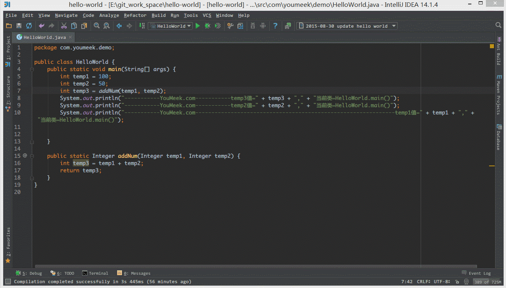
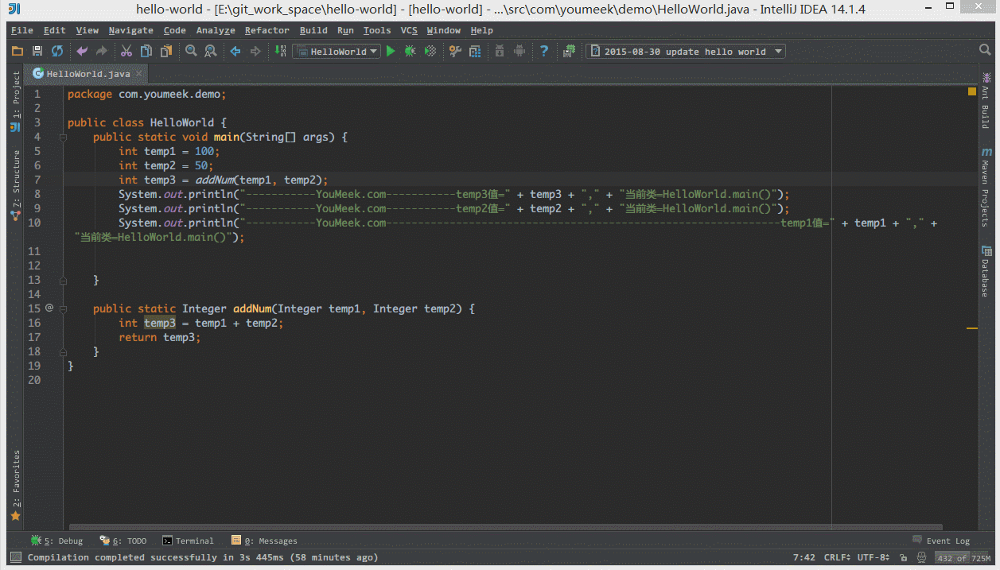
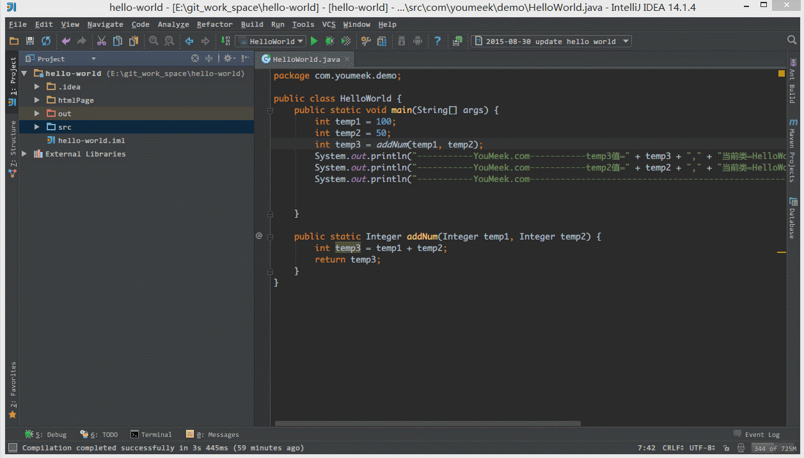
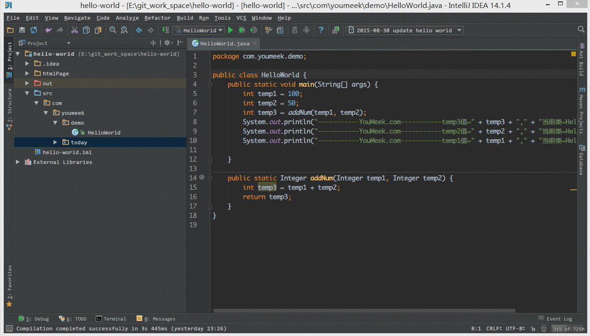
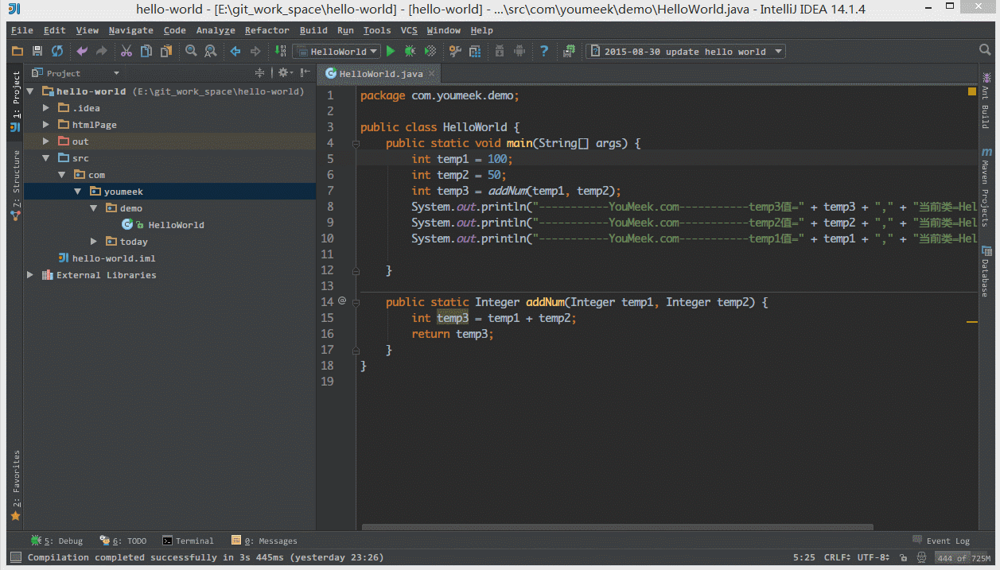

# IntelliJ IDEA 常用设置讲解 - 2

## 说明

IntelliJ IDEA 有很多人性化的设置我们必须单独拿出来讲解，也因为这些人性化的设置让我们这些 IntelliJ IDEA 死忠粉更加死心塌地使用它和分享它。

## 常用设置

- 如上图 Gif 所示，当我们设置了组件窗口的 `Pinned Mode` 属性之后，在切换到其他组件窗口的时候，已设置该属性的窗口不会自动隐藏。

----------------------------------------------------------------------------

- 如上图 Gif 所示，我们可以对某些文件进行添加到收藏夹，然后在收藏夹组件窗口中可以查看到我们收藏的文件。

----------------------------------------------------------------------------

- 如上图 Gif 所示，我们可以通过 `Alt + F1` + `1` 快捷键来定位当前文件所在 Project 组件窗口中的位置。

----------------------------------------------------------------------------

- 如上图 Gif 所示，我们可以勾选此设置后，增加 `Ctrl + 鼠标滚轮` 快捷键来控制图片的大小显示。

----------------------------------------------------------------------------

- 如上图 Gif 所示，我们选中要被折叠的代码按 `Ctrl + Alt + T` 快捷键，选择自定义折叠代码区域功能。

----------------------------------------------------------------------------

- 如上图 Gif 所示，即使我们项目没有使用版本控制功能，IntelliJ IDEA 也给我们提供了本地文件历史记录。除了简单的记录之外，我们还可以给当前版本加标签。

----------------------------------------------------------------------------

- 如上图 Gif 所示，我们还可以根据选择的代码，查看该段代码的本地历史，这样就省去了查看文件中其他内容的历史了。除了对文件可以查看历史，文件夹也是可以查看各个文件变化的历史。

----------------------------------------------------------------------------

- 如上图 Gif 所示，IntelliJ IDEA 默认是会折叠空包的，这样就会出现包名连在一起的情况。但是有些人不喜欢这种结构，喜欢整个结构都是完整树状的，所以我们可以去掉演示中的勾选框即可。

----------------------------------------------------------------------------

