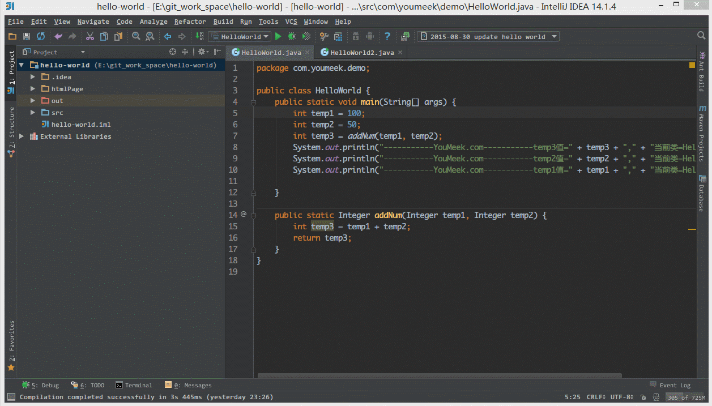
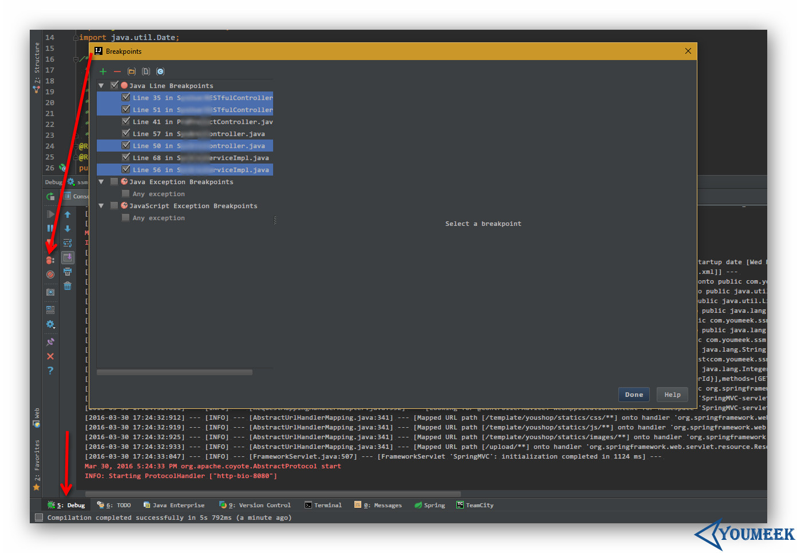
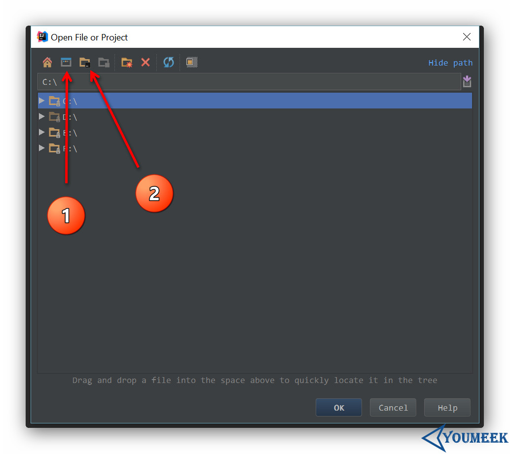
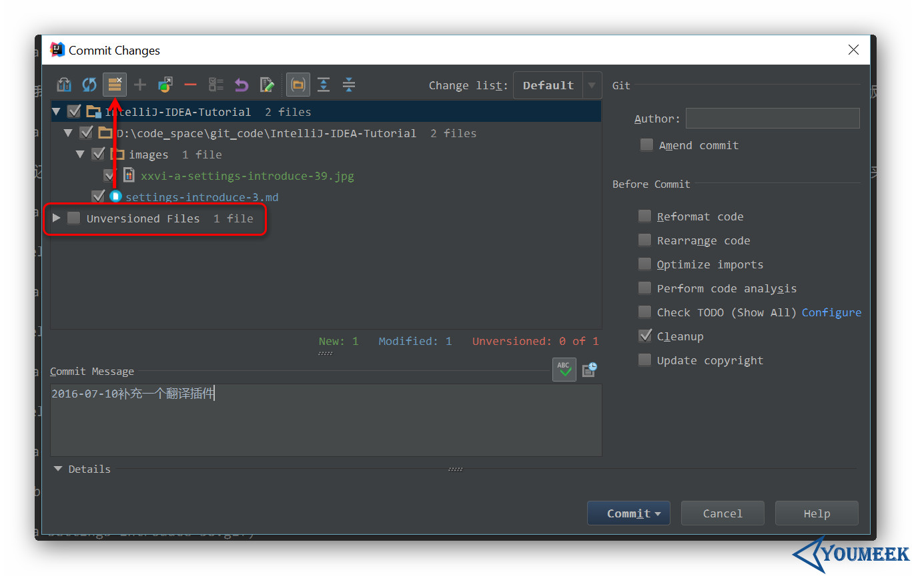

# IntelliJ IDEA 常用设置讲解 - 3

## 说明

IntelliJ IDEA 有很多人性化的设置我们必须单独拿出来讲解，也因为这些人性化的设置让我们这些 IntelliJ IDEA 死忠粉更加死心塌地使用它和分享它。

## 常用设置

- 如上图 Gif 所示，当我们在编辑某个文件的时候，自动定位到当前文件所在的 Project 组件窗口位置。

----------------------------------------------------------------------------

- 如上图 Gif 所示，IntelliJ IDEA 自带了代码检查功能，可以帮我们分析一些简单的语法问题和一些代码细节。

----------------------------------------------------------------------------

- 如上图 Gif 所示，IntelliJ IDEA 自带模拟请求工具 Rest Client，在开发时用来模拟请求是非常好用的。

----------------------------------------------------------------------------

- 如上图 Gif 所示，IntelliJ IDEA 的自定义 TODO 功能非常好用，强烈建议平时开发要经常使用上。

----------------------------------------------------------------------------

- 如上图箭头所示，在 Debug 状态下，如果我们要批量删除断点，可以点击图上箭头所示的按钮，然后选中要删除的断点按断点上面的减号进行删除。

----------------------------------------------------------------------------

- 如上图所示，不管是用 IntelliJ IDEA 打开新文件，或是在安装本地插件，在弹出的窗口中，图 1 按钮支持快速定位到系统桌面目录，图 2 按钮支持快速定位到当前项目目录。

----------------------------------------------------------------------------

- 2016.2 版本新增箭头指向的按钮，在提交列表里可以显示项目中未加入到版本控制的文件，方便我们在提交的时候做好代码检查，以防漏掉某些文件未提交。

----------------------------------------------------------------------------

