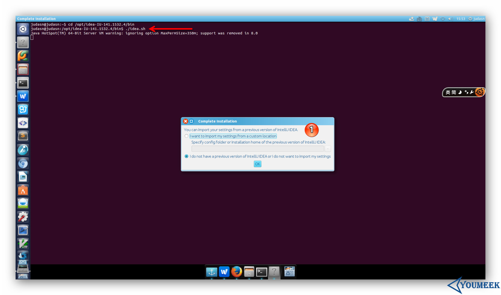
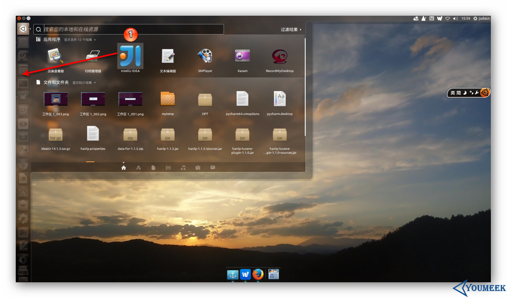

# Ubuntu 系统下安装 IntelliJ IDEA

## 系统要求

> * 系统支持：只要是支持 GNOME 或 KDE 桌面系统，建议是 Ubuntu（32位和64位都可以）
> * JDK 版本：Oracle JDK 1.6 或以上
> * 内存：最低要求 1 GB，推荐 2 GB 以上
> * 硬盘：最低要求 2 GB
> * 显示器：最低要求 1024 X 768 分辨率
> * 更多信息可以阅读：<https://www.jetbrains.com/help/idea/install-and-set-up-intellij-idea.html>

## 重要说明

我这里以 Ubuntu 系统为例进行讲解。但是，在学习下面内容之前请先看下章节：[Windows 下安装](windows-install.md)

因为它们配置流程是基本一样的，只是系统不同，开始的步骤不太一样而已，因此相同部分我这里是不会再讲的，我只讲 IntelliJ IDEA 在 Linux 安装特殊的地方。

## Ubuntu 下安装过程

先把你下载到的 `ideaIU-14.1.4.tar.gz` 移动到你平时存放软件的目录下，然后进行解压，我电脑是放在 /opt 下。
> * 终端下解压命令：`tar xfz ideaIU-14.1.4.tar.gz`，解压出来的目录名称是：`idea-IU-141.1532.4`
> * 可能在解压过程中你需要 `sudo` 命令权限，或者是切换到 root 账号下。如果你是切换到 root 用户下就一定要注意，解压完记得再切回来你常用的账户，不然等下生成的 IntelliJ IDEA 配置文件是放在 `/home/root` 下，这样就跟你常用的那个用户没啥关系了。

> * 在假设你已经通过终端切换到了你常用的用户下之后，现在用终端进入解压目录下的 `bin 子目录` 下，然后在终端下运行启动命令：`./idea.sh`，运行的效果如上图箭头所示。剩下的配置步骤就跟 Windows 基本一样了，如标注 1 所示，所以这里不多讲。

> * 其中，在整个首次启动的配置过程中，唯一跟 Windows 不太一样的就是上图标注 1 这个地方。原因是 Linux 下创建启动图标是非常非常非常的麻烦，所以 IntelliJ IDEA 帮我们考虑到了，所以只要勾选下即可解决这种麻烦事。

> * 创建完启动图标之后，我们可以在如上图标注 1 所示的 Dash 这个地方找到 IntelliJ IDEA 图标。但是图标我们一般是放在启动栏上的，所以这里你可以按着箭头的方向拖动 IntelliJ IDEA 图标到启动栏上即可。

> * 启动的最后效果如上图，是不是有点过于简单了？！

## 卸载

Linux 的卸载是不需要执行程序的，只需要：删除对应目录。
> * 删除主程序目录，也就是我们本文上面讲的解压出来的 `idea-IU-141.1532.4`。
> * 如果不想保留你的配置文件，还可以删除配置目录，目录所在位置：./home/你用登录名/.IntelliJIdea14
