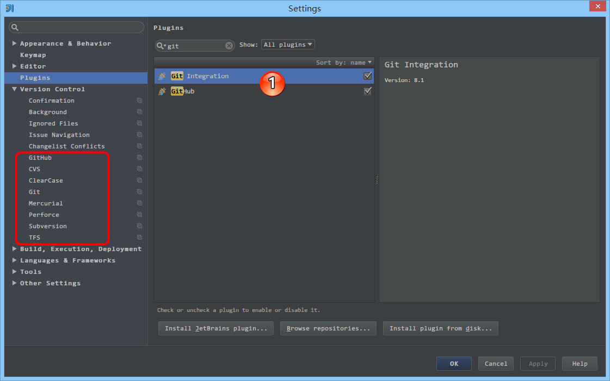
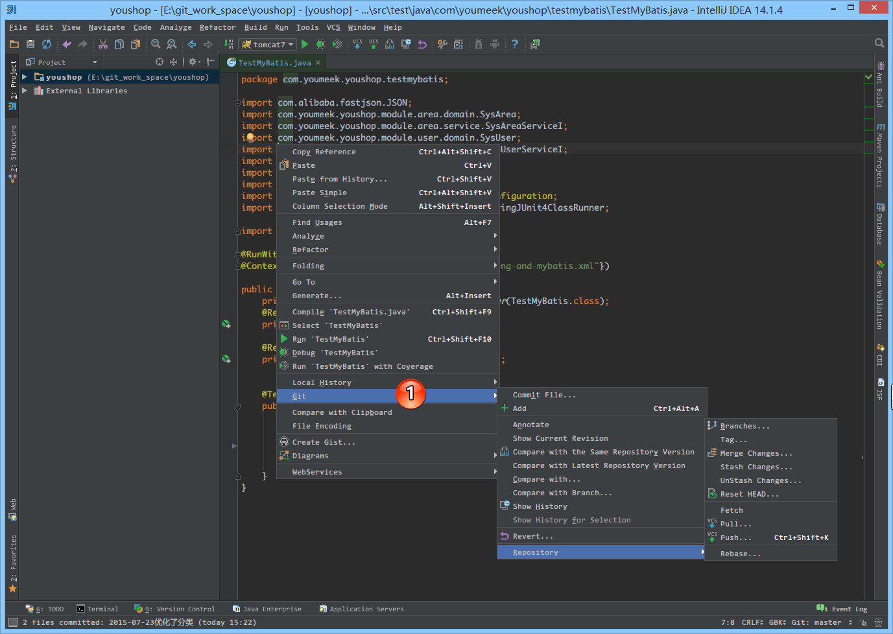
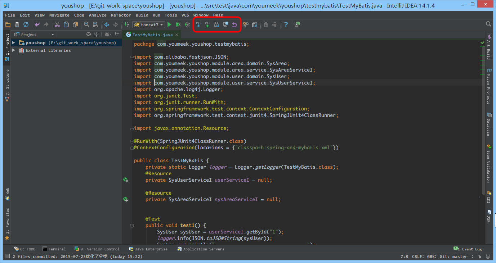
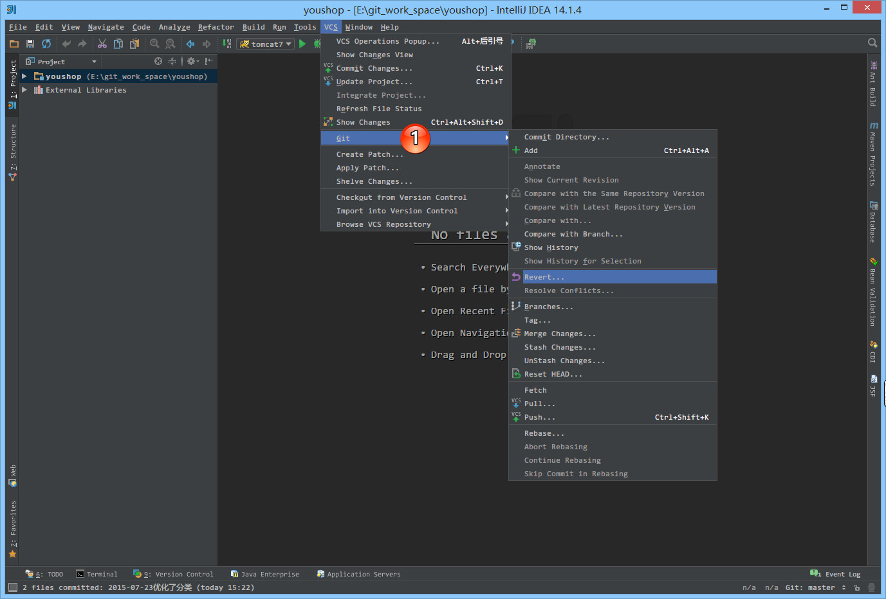
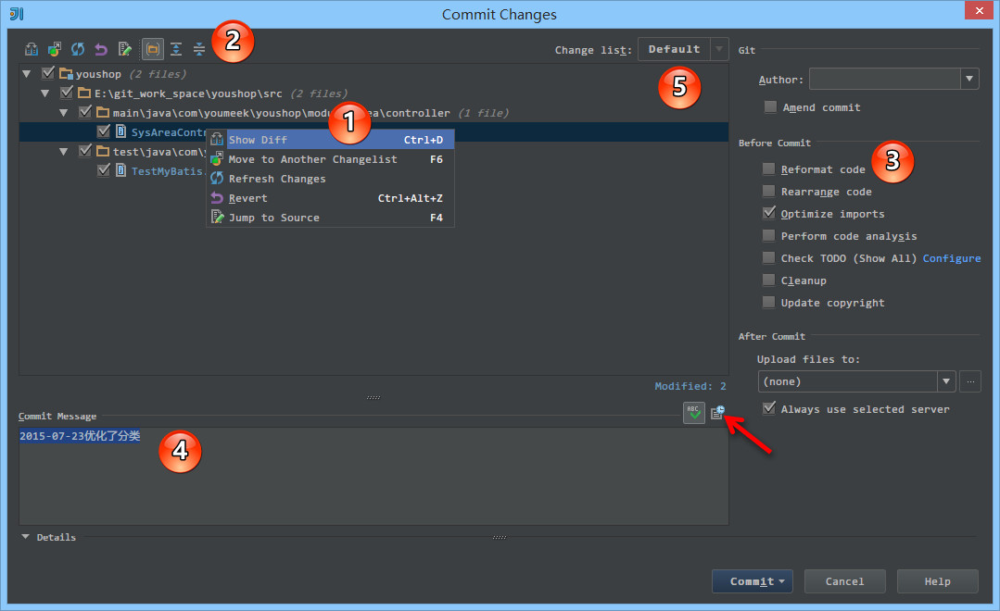
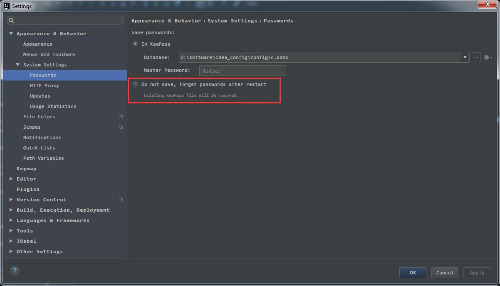
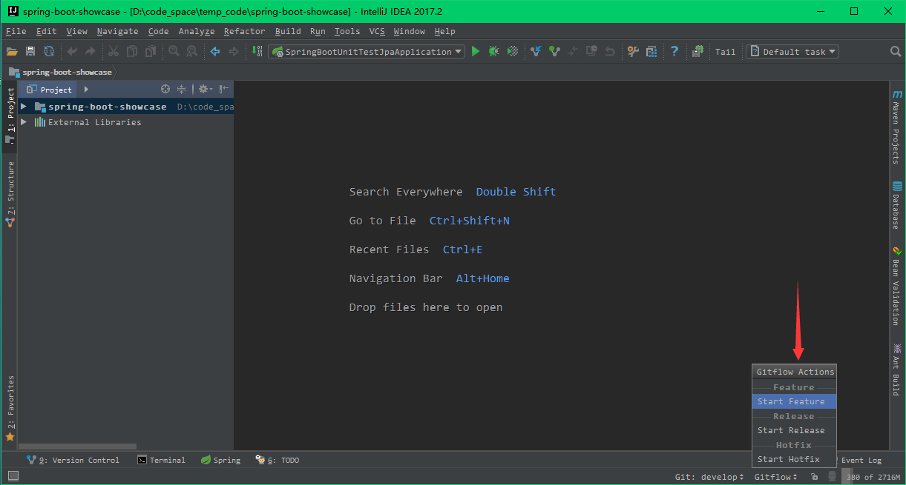

# 版本控制的使用

## IntelliJ IDEA 下的版本控制介绍

这一章节放在这么靠前位置来讲是因为版本控制在我心目中的地位比后面的实战知识点都来得重要。不管是个人开发或是团队开发，版本控制都是可以很好地被使用的，目前我找不到任何开发者不使用版本控制的理由。而且对于 IDE 来讲，集成版本控制的本身就是它最大的亮点之一，很多开发者也是为此而使用它。

在本章节中也会对 IntelliJ IDEA 的相关版本控制进行了介绍，会开始涉及到一些 IntelliJ IDEA 人性化设置，也希望你能从这一讲开始认识到 IntelliJ IDEA 的优雅。

> * 很多人认为 IntelliJ IDEA 自带了 SVN 或是 Git 等版本控制工具，认为只要安装了 IntelliJ IDEA 就可以完全使用版本控制应有的功能。这完全是一种错误的解读，IntelliJ IDEA 是自带对这些版本控制工具的支持插件，但是该装什么版本控制客户端还是要照样装的。
> * 如上图标注 1 所示，IntelliJ IDEA 对版本控制的支持是以插件化的方式来实现的。旗舰版默认支持目前主流的版本控制软件：CVS、Subversion（SVN）、Git、ClearCase、Mercurial、Perforce、TFS。又因为目前太多人使用 Github 进行协同或是项目版本管理，所以 IntelliJ IDEA 同时自带了 Github 插件，方便 Checkout 和管理你的 Github 项目。

## SVN 的配置

要在 IntelliJ IDEA 中使用 SVN，需要先安装 SVN 客户端或是 TortoiseSVN 这类图形化工具，Windows 系统这里推荐安装 TortoiseSVN，即使在不使用 IntelliJ IDEA 也可以方便管理我们的项目。

SVN 主要使用的版本有 1.6、1.7、1.8，最新的是 1.9。推荐大家使用 1.8 的。如果你的项目使用的是 1.6 的版本，在安装 1.8 之后是可以直接对项目文件进行升级的，所以无需担心，也因此更加推荐大家使用 1.8。

> * Subversion 官网下载：<https://subversion.apache.org/download/#recommended-release>
> * TortoiseSVN 官网下载：<http://tortoisesvn.net/downloads.zh.html>

> * 如上图箭头所示，在安装 TortoiseSVN 的时候，默认 `command line client tools`，是不安装的，这里建议勾选上。

> * 如上图标注 1 所示，勾选 `Use command line client`
> * 如上图标注 2 所示，建议 svn 的路径自己根据安装后的路径进行选择，不然有时候 IntelliJ IDEA 无法识别到会报：`Cannot run program "svn"` 这类错误。
> * 如上图标注 3 所示，当使用一段时间 SVN 以后，发现各种 SVN 相关问题无法解决，可以考虑点击此按钮进行清除一下缓存。

根据目前的使用经验来看，IntelliJ IDEA 下 SVN 的使用经历并不算愉快，至少比 Git 不好用很多，经常遇到很多问题，所以这里也算是先给大家提个醒。如果紧急情况下 IntelliJ IDEA 无法更新、提交的时候，要记得使用 TortoiseSVN 来操作。

## Git 的配置

要在 IntelliJ IDEA 中使用 Git，需要先安装 Git 客户端，这里推荐安装官网版本。

Git 主要的版本有 1.X、2.X，最新的是 2.X，使用版本随意，但是不要太新了，不然可能 IntelliJ IDEA 小旧版本会无法支持可能。

> * Git 官网下载：<http://git-scm.com/>
> * TortoiseGit 官网下载：<http://download.tortoisegit.org/tgit/>

如上图标注 1 所示，确定好该路径下是否有对应的可执行文件。

## Github 的配置和使用

> * 如上图标注 1 所示，填写你的 Github 登录账号和密码，点击 `Test` 可以进行测试是否可以正确连上。

> * 如上图标注 1 所示，支持直接从你当前登录的 Github 账号上 Checkout 项目。

> * 如上图标注 1 所示，支持把当前本地项目分享到你的 Github 账号上。

> * 如上图标注 1 所示，支持创建 `Gist`。Github 的 Gist 官网地址：<https://gist.github.com/>

## 版本控制主要操作按钮

> * 如上图标注 1 所示，对目录进行右键弹出的菜单选项。

> * 如上图标注 1 所示，对文件进行右键弹出的菜单选项。

> * 如上图标注红圈所示，为工具栏上版本控制操作按钮，基本上大家也都是使用这里进行操作。
>
>> * 第一个按钮：`Update Project` 更新项目。
>> * 第二个按钮：`Commit changes` 提交项目上所有变化文件。点击这个按钮不会立马提交所有文件，而是先弹出一个被修改文件的一个汇总框，具体操作下面会有图片进行专门介绍。
>> * 第三个按钮：`Compare with the Same Repository Version` 当前文件与服务器上该文件通版本的内容进行比较。如果当前编辑的文件没有修改，则是灰色不可点击。
>> * 第四个按钮：`Show history` 显示当前文件的历史记录。
>> * 第五个按钮：`Revert` 还原当前被修改的文件到未被修改的版本状态下。如果当前编辑的文件没有修改，则是灰色不可点击。

> * 如上图标注 1 所示，菜单栏上的版本控制操作区。

## 版本控制相关的常用设置说明

> * 如上图标注 1 所示，当前项目使用的版本控制是 `Git`。如果你不愿意这个项目继续使用版本控制可以点击旁边的减号按钮，如果你要切换版本控制，可以点击 `Git`，会出现 IntelliJ IDEA 支持的各种版本控制选择列表，但是我们一般情况下一个项目不会有多个版本控制的。
> * 如上图标注 2 所示，`Show directories with changed descendants` 表示子目录有文件被修改了，则该文件的所有上层目录都显示版本控制被修改的颜色。默认是不勾选的，我一般建议勾选此功能。

> * 如上图标注 1 所示，`When files are created` 表示当有新文件放进项目中的时候 IntelliJ IDEA 做如何处理，默认是 `Show options before adding to version control` 表示弹出提示选项，让开发者决定这些新文件是加入到版本控制中还是不加入。如果不想弹出提示，则选择下面两个选项进行默认操作。
> * 如上图标注 2 所示，`When files are deleted` 表示当有新文件在项目中被删除的时候 IntelliJ IDEA 做如何处理，默认是 `Show options before removing from version control` 表示弹出提示选项，让开发者决定这些被删除的是否从版本控制中删除。如果不想弹出提示，则选择下面两个选项进行默认操作。

> * 如上图标注 1 所示，对于不想加入到版本控制的文件，可以添加要此忽略的列表中。但是如果已经加入到版本控制的文件使用此功能，则表示该文件 或 目录无法再使用版本控制相关的操作，比如提交、更新等。我个人使用过程中发现在 SVN 上此功能不太好用，Git 上是可以用的。

> * 上图所示的弹出层就是本文上面说的 `Commit Changes` 点击后弹出的变动文件汇总弹出层。
> * 如上图标注 1 所示，可以在文件上右键进行操作。
>
>> * `Show Diff` 当前文件与服务器上该文件通版本的内容进行比较。
>> * `Move to Another Changelist` 将选中的文件转移到其他的 `Change list` 中。`Change list` 是一个重要的概念，这里需要进行重点说明。很多时候，我们开发一个项目同时并发的任务可能有很多，每个任务涉及到的文件可能都是基于业务来讲的。所以就会存在一个这样的情况：我改了 30 个文件，其中 15 个文件是属于订单问题，剩下 15 个是会员问题，那我希望提交代码的时候是根据业务区分这些文件的，这样我填写 `Commit Message` 是好描述的，同时在文件多的情况下，我也好区分这些要提交的文件业务模块。所以我一般会把属于订单的 15 个文件转移到其他的 `Change list`中，先把专注点集中在 15 个会员问题的文件，先提交会员问题的 `Change list`，然后在提交订单会员的 `Change list`。我个人还有一种用法是把一些文件暂时不提交的文件转移到一个我指定的 `Change list`，等后面我觉得有必要提交了，再做提交操作，这样这些文件就不会干扰我当前修改的文件提交。总结下 `Change list` 的功能就是为了让你更好地管理你的版本控制文件，让你的专注点得到更好的集中，从而提升效率。
>> * `Jump to Source` 打开并跳转到被选中。 
> * 如上图标注 2 所示，可以根据工具栏按钮进行操作，操作的对象会鼠标选中的文件，多选可以按 `Ctrl` 后不放，需要注意的是这个跟前面的复选框是没有多大关系的。
> * 如上图标注 3 所示，可以在提交前自动对被提交的文件进行一些操作事件（该项目使用的 Git，使用其他版本控制可能有些按钮有差异。）：
>
>> * `Reformat code` 格式化代码，如果是 Web 开发建议不要勾选，因为格式化 JSP 类文件，格式化效果不好。如果都是 Java 类则可以安心格式化。 
>> * `Rearrange code` 重新编排代码，IntelliJ IDEA 支持各种复杂的编排设置选项，这个会在后面说。设置好了编码功能之后，这里就可以尝试勾选这个进行自动编排。 
>> * `Optimize imports` 优化导入包，会自动去掉没有使用的包。这个建议都勾选，因其只对 Java 类有作用，所以不用担心有副作用。 
>> * `Perform code analysis` 进行代码分析，这个建议不用在提交的时候处理，而是在开发完之后，要专门养成对代码进行分析的习惯。IntelliJ IDEA 集成了代码分析功能。
>> * `Check TODO` 检查代码中的 `TODO`。`TODO` 功能后面也会有章节进行讲解，这里简单介绍：这是一个记录待办事项的功能。 
>> * `Cleanup` 清除下版本控制系统，去掉一些版本控制系统的错误信息，建议勾选（主要针对 SVN，Git 不适用）。 
> * 如上图标注 4 所示，填写提交的信息。
> * 如上图标注 5 所示，`Change list` 改变列表，这是一个下拉选项，说明我们可以切换不同的 `Change list`，提交不同的 `Change list` 文件。
> * 如上图标注箭头所示，我们可以查看我们提交历史中使用的 `Commit Message`，有些时候，我们做得是同一个任务，但是需要提交多次，为了更好管理项目，建议是提交的 `Message` 是保持一致的。

> * 如上图标注箭头所示，如果你使用的 Git，点击此位置可以切换分支和创建分支，以及合并、删除分支等操作。

## SVN 的使用

SVN 的这个窗口有的 IntelliJ IDEA 上叫 `Changes`，有的叫 `Version Control`，具体是什么原因引起这样的差异，我暂时还不清楚。但是不管叫法如何里面的结构是一样的，所以对使用者来讲没多大影响，但是你需要知道他们其实是一样的功能即可。

上图 `Local Changes` 这个 Tab 表示当前项目的 SVN 中各个文件的总的情况预览。这里的 `Default` 是 IntelliJ IDEA 的默认 change list 名称，`no commit` 是我自己创建的一个change list，我个人有一个习惯是把一些暂时不需要提交的先放这个 list 里面。change list 很常用而且重要，本文前面也有强调过了，所以一定好认真对待。`unversioned Files` 表示项目中未加到版本控制系统中的文件，你可以点击 `Click to browse`，会弹出一个弹出框列表显示这些未被加入的文件。

上图 `Repository` 这个 Tab 表示项目的 SVN 信息汇总，内容非常的详细，也是我平时用最多的地方。如果你点击这个 Tab 没看到数据，是因为你需要点击上图红圈这个刷新按钮。初次使用下默认的过滤条件不是我上图这样的，我习惯根据 User 进行过滤筛选，所以上图箭头中的 Filter 我是选择 User。选择之后，如上图标注 1 所示，显示了这个项目中参与提交的各个用户名，选择一个用户之后，上图标注 2 所以会显示出该用户提交了哪些记录。选择标注 2 区域中的某个提交记录后，标注 3 显示对应的具体提交细节，我们可以对这些文件进行右键操作，具体操作内容跟本文上面提到的那些提交时的操作按钮差不多，这里不多讲。

总的来说，SVN 这个功能用来管理和审查开发团队中人员的代码是非常好用的，所以非常非常建议你一定要学会该功能。

## Git 常见问题

- 更新的时候报：`Can't update: no tracked branch`
	- 解决办法：打开 git-bash（路径：C:\Program Files\Git\git-bash.exe），切换到这个更新不下来的项目的根目录，然后输入：`git branch --set-upstream-to origin/master master`，回车之后重新回到 IntelliJ IDEA 进行更新，正常就可以了。
- 输错密码后，弹出验证的登录框没有再出现：
	- 解决办法如下图：选择 `Do not save, forget passwords after restart` 等你确定你的密码没错后再选择保存密码方案。
	

## Git Flow 的介绍

### Git Flow 概念

- Git Flow 是一个 git 扩展集，按 Vincent Driessen 的分支模型提供高层次的库操作。这里的重点是 Vincent Driessen 的分支模型思想，下面讲解的内容也是基于 Vincent Driessen 思想。
	- Vincent Driessen 的观点：<http://nvie.com/posts/a-successful-git-branching-model/>
	- `Git Flow 是一个 git 扩展集` 你可以理解 Git Flow 是一个基于 Git 的插件，这个插件简化了 Git 一些复杂的命令，比如 Git Flow 用一条命令，就可以代替 Git 原生 10 条命令。
	- Git Flow 对原生的 Git 不会有任何影响，你可以照旧用 Git 原生命令，也可以使用 Git Flow 命令。
- 还有其他的一些分支管理模型思想，具体可以看：<http://www.ruanyifeng.com/blog/2015/12/git-workflow.html>

### Git Flow 核心概念

- 必须有的两个核心分支（长期分支）：
	- master，Git 代码仓库中默认的一条主分支。这条分支上的代码一般都建议为是正式版本的代码，并且这条分支不能进行代码修改，只能用来合并其他分支。
	- develop，一般用于存储开发过程的代码分支，并且这条分支也不能进行代码修改，只能用来合并其他辅助分支。
- 根据情况创建的辅助分支（临时分支）
	- feature branches（功能分支）
		- **基于 develop 分支上创建**
		- **开发完成后合并到 develop 分支上**
		- 当要开始一个新功能的开发时，我门可以创建一个 Feature branches 。等待这个新功能开发完成并确定应用到新版本中就合并回 develop
		- 对于单人开发的 feature branches，start 之后，开发完成后可以直接 finish。
		- 对于多人开发的 feature branches，start 之后，开发完成后先 publish 给其他开发人员进行合并，最后大家都开发完成后再 finish。这个思路也同样适用下面几个辅助分支场景。
		- feature branches 开发过程有 bug，直接在 feature branches 上修改、提交。
	- release branches（预发布分支）
		- **基于 develop 分支上创建**
		- **测试确定新功能没有问题，合并到 develop 分支和 master 分支上**
		- 用来做新版本发布前的准备工作，在上面可以做一些小的 bug 修复、准备发布版本号等等和发布有关的小改动，其实已经是一个比较成熟的版本了。另外这样我们既可以在预发布分支上做一些发布前准备，也不会影响 "develop" 分支上下一版本的新功能开发。
	- hotfix branches（基于 master 基础上的生产环境 bug 的修复分支）
		- **基于 master 分支上创建**
		- **修复测试无误后合并到 master 分支和 develop 分支上**
		- 主要用于处理线上版本出现的一些需要立刻修复的 bug 情况

### Git Flow 安装

- Windows：如果你安装 Git 用的是 [Git for Windows](https://git-for-windows.github.io/)，那它已经内置了。
- Mac：`brew install git-flow-avh`
- Linux：`wget --no-check-certificate -q  https://raw.githubusercontent.com/petervanderdoes/gitflow-avh/develop/contrib/gitflow-installer.sh && sudo bash gitflow-installer.sh install stable; rm gitflow-installer.sh`
- 更多版本：<https://github.com/petervanderdoes/gitflow-avh/wiki/Installation>
- 在系统环境上支持之后，再安装 IntelliJ IDEA 对 Git Flow 支持的插件：<https://plugins.jetbrains.com/plugin/7315-git-flow-integration>

### Git Flow 基础命令资料

- <https://danielkummer.github.io/git-flow-cheatsheet/index.zh_CN.html>
- <http://www.jianshu.com/p/9e4291078853>
- <http://stormzhang.com/git/2014/01/29/git-flow/>

### Git Flow Integration 插件的使用

- 如果你已经理解了上面的理论，再看下面这些截图你能理解对应的是什么意思。

