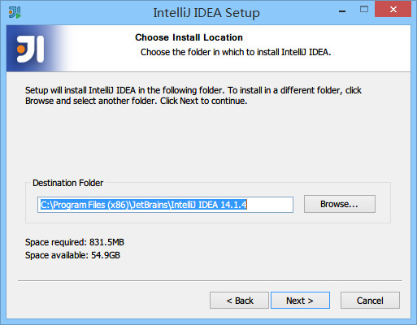
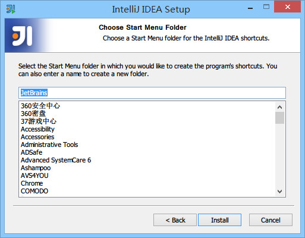
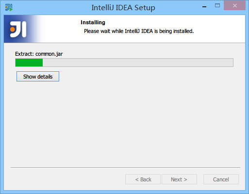
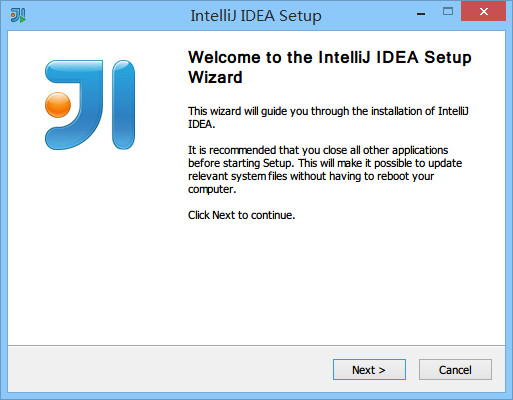
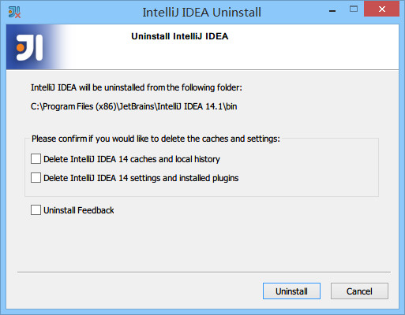

# Windows 系统下安装 IntelliJ IDEA

## 1.系统要求

> * 系统支持：Microsoft Windows 8 / 7 / Vista / 2003 / XP（每个系统版本的32位和64位都可以）
> * JDK 版本：Oracle JDK 1.6 或以上
> * 内存：最低要求1G，推荐2G以上
> * 硬盘：最低要求2G
> * 显示器：最低要求 1024 X 768 分辨率
> * 更多信息可以阅读：<https://www.jetbrains.com/idea/download/system_requirements.jsp?os=win>

## 2.首次安装

> * IntelliJ IDEA 的安装是非常简单的，不需要做过多的选择，可以说简单到都是 `Next` 即可。

> * 上图标记 1 表示在桌面上创建一个快捷图标，建议勾选上，方便我们在安装后定位 IntelliJ IDEA 安装目录。
> * 上图标记 2 表示关联 Java 和 Groovy 文件，建议都不要勾选，正常我们会在 Windows 的文件系统上打开这类文件都是为了快速查阅文件里面的内容，如果用 IntelliJ IDEA 关联上之后，由于 IntelliJ IDEA 打开速度缓慢，这并不能方便我们查看。
> * 建议在 Windows 系统上关联此类文件可以用 EmEditor、Notepad++ 这类轻便的编辑器。

> * 整个安装过程，一般的配置电脑安装所需的时间大约是 1 ~ 5 分钟。

## 3.已有旧版本安装新版本

> * 上图，显示我目前电脑中已经有一个 IntelliJ IDEA 版本，如果我勾选了标记 1，则表示安装之前会先卸载掉电脑上的旧版本。
> * 上图标记 2，如果勾选了，则 IntelliJ IDEA 在卸载旧版本的时候直接删除掉你旧版本的个性化设置，这里不推荐勾选。
> * 在小版本迭代中建议是卸载掉旧版本的，然后再进行新版本安装，因为小版本迭代一般都是 Bug 的修复，保留旧版本没有多大意义。
> * 在大版本迭代中建议是保留旧版本，也就是不勾选上图标注 1，IntelliJ IDEA 是支持一台电脑装多个版本的。
> * 接下来的步骤我们假设勾选了标注 1 再进行安装。

> * 上图，由于上一步勾选了卸载旧版本选项，所以出现了选择删除旧版本的配置选项。
> * 第一个选项：删除旧版本的缓存和本地历史记录。
> * 第二个选项：删除旧版本的个人个性化设置。
> * 建议两个都不要勾选。
> * 点击 uninstall，进入全自动的卸载过程，卸载完成接下来的步骤跟上文“首次安装”一致，这里不再进行说明。

## 4.卸载

> * 卸载过程在第 3 点已经有涉及到了，专门对 IntelliJ IDEA 进行卸载也是一样的流程。

